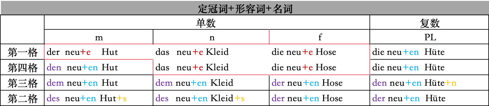
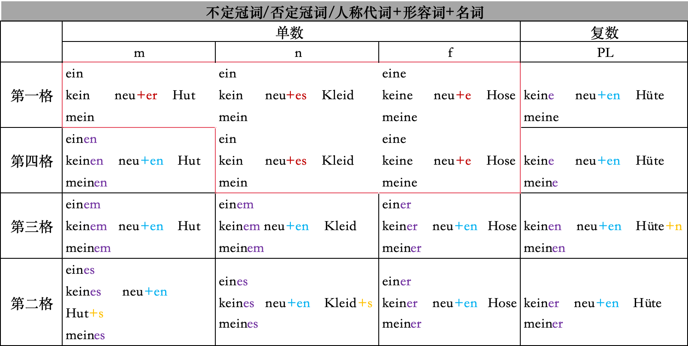
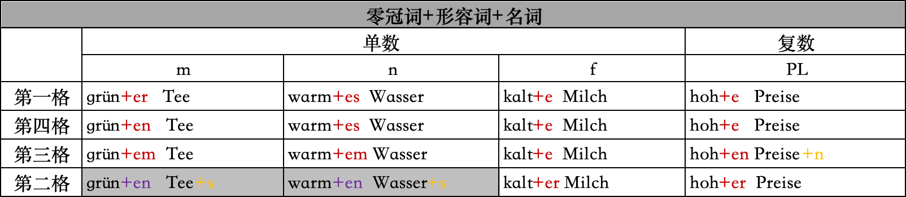
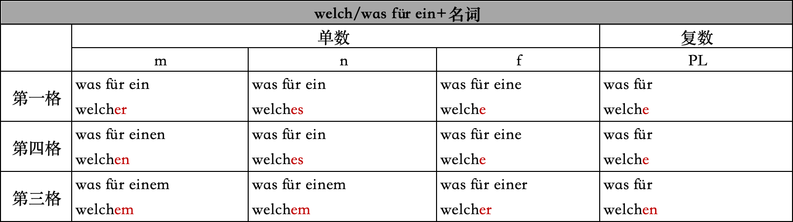
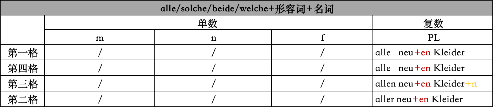
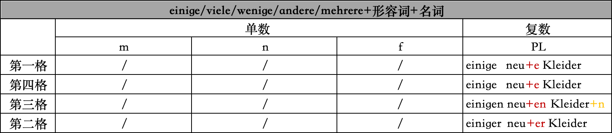

# 形容词变位

## 定冠词+形容词+名词

## 不定冠词/否定冠词/人称代词+形容词+名词

## 零冠词+形容词+名词

* 零冠词：显性;但是第二格的阳性，中性除外

## welch/was für ein+名词

## alle/solche/beide/welche+形容词+名词

* alle后面的形容词都加词尾+en

## einige/viele/wenige/andere/mehrere+形容词+名词

* einige后面的形容词词尾变化同复数零冠词的词尾变化一致
* viel和venig在不可数名词前无词尾变化，而他们后面的形容词词尾变化同零冠词词尾一致

## 特殊词
* dunkel  teuer hoch 加词尾后去e 和c
*  -a结尾的形容词：不加词尾 ，rosa，lila，prima
* 城市名词+er +名词 不加词尾

