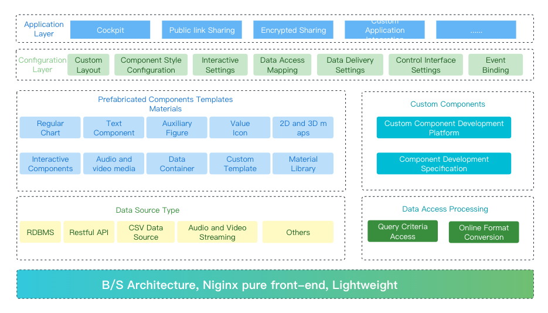

# Nantian Big Screen

* NtDatav is a microcode development platform based on Echarts, suitable for any WEB project
* Simple, agile, efficient, versatile, and highly customizable, instantly elevating your project's level
* Completely connecting the front and back ends, supporting graphic data linkage, filtering, drilling, and supporting almost all common databases
* Building block development model, ready to use out of the box, easy to install, less dependent, and suitable for various platforms
* Highly customizable

# Architecture Diagram

# System Requirements

* JDK >= 1.8
* MySQL >= 5.7
* Maven >= 3.0
* Node >= 12
* Redis >= 3

# Application Scenario

NtDatav is not only a tool, but also a complete enterprise level business intelligence solution platform. NtDatav can enable enterprises to better utilize the advantages of big data, cloud computing, etc. For data modeling, data analysis, and data visualization, achieving data assisted decision-making.

**Government Scenario:** Utilizing big data and business intelligence is the key to achieving the transformation of a digital smart city. Combined with the Internet of Things information, it is possible to manage the city's transportation information, people's livelihood information, medical information, social security management, epidemic data monitoring, party and government training management, park information, etc. more quickly and better. To achieve optimal allocation of resources, assist government departments in public management, and make scientific decisions using data.

**Financial scenario:** can be applied to marketing, risk control, wealth management, and other aspects. Including customer profiling, enhancing customer value, customer relationship management, performance management, risk control credit rating, precision marketing, anti fraud and anti money laundering application scenarios.

**Retail scenario:** can be applied to customer behavior analysis, cost control, inventory management, supplier management, product sales analysis, profit analysis, and forecasting. The application of NtDatav can help achieve business growth, reduce costs, and increase market share.

**Medical scenario:** By analyzing patients' health information, hospitalization information, doctors' diagnosis and treatment information, surgical data, rehabilitation information, drug information, medical device information, and financial data, we can improve patients' rehabilitation and help hospitals improve operational efficiency and regulatory quality.

**Industrial scenario:** can be applied to inventory management, analysis and prediction of production efficiency and product qualification rate, management of sales and ordering information, product quality management, analysis of dealer and customer situations based on mastered data, optimization of production lines, and improvement of business operations.

**Education scenario:** can be applied to education fund management, student performance analysis and prediction, analysis and statistics of teacher teaching quality and teaching situation, analysis of student quality and skills, and monitoring of school operations. To improve students' comprehensive quality and assist in school operation and management.

