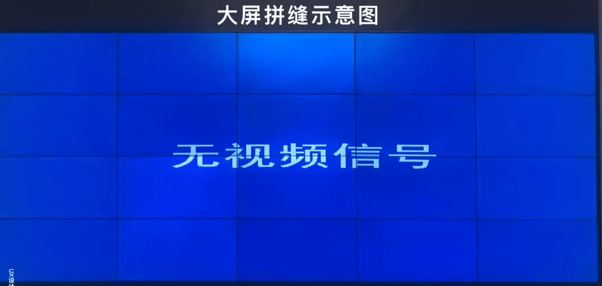

# Precautions for Big screen design

## 1. Font usage

Priority should be given to using the system default font. When embedding fonts, consideration should be given to their recognizability, compatibility with the current design style, and free commercial use.

If the page is deployed in the cloud and needs to embed a font package, we can use software such as * * FontCreator * * to remove unused characters from the font package, and then repackage and upload them to reduce the size of the font package. This can optimize the page loading experience and avoid page text jumping during the process of replacing the default font. (Generally speaking, a set of font files contains various characters such as Arabic, symbols, Latin, Japanese, Cyrillic, Greek, Pinyin, and Pinyin. For the clear scenario of a large screen, we can delete other characters that are not used and only retain Chinese, Pinyin, and numbers.)

On issues related to font copyright acquisition, the official account replied to "visual" acquisition

## 2. Color matching

1. * * Significant differences in color brightness and saturation * *, sharp contrast, try to avoid using adjacent color schemes

2. Use a dark background: A dark background can reduce discomfort caused by stitching. Due to the large background area, using a dark background can also reduce the impact of screen color difference on overall performance; At the same time, a dark background is more visually focused, making it easier to highlight content and create cool effects such as streamers and particles,

3. Use gradient colors with caution: Large screens generally have color gamut deviations, resulting in color deviation. Therefore, when using gradient colors, it is necessary to determine whether to adjust based on the feedback from the large screen, and pure colors are the best.

## 3. Page Layout

Clear prioritization, clear organization, attention to white space, reasonable utilization of small display units on the large screen, and efforts to avoid key data being pieced together for segmentation

