# Data Visualization "Color Matching Secret"

-[Data Visualization "Color Matching Secret"](https://mp.weixin.qq.com/s?__biz=MzIwMTM3OTg5MA==&mid=2683439539&idx=1&sn=b96b527457aca15d6849b3d2e99bdb14&chksm=8ce870eebb9ff9f8d3279986b83b93134898aa42329d7fca2d0360197fdaba1f427f9ae16a71&scene=178&cur_album_id=1694704160148930560#rd)

The most crucial function of data charts is to visually display data and enable people to understand it. Therefore, when visualizing data, * * color schemes should not be chosen based on personal preferences, but should understand that they bear the responsibility of explaining the data, and * * should focus on highlighting the core content by combining the data. The variety of colors is dazzling, and at this time, you need to be more clear about the role of color matching and use it with a certain emphasis.

## 1. Rich color scheme, suitable for light and shade

Firstly, in order to make the color scheme recognizable, we often choose more diverse color schemes, and the colors need to have a span that is clear but not too flashy.

For the leadership cockpit or data screen, we also need to consider its usage scenarios. If displayed on a large screen, due to the unique nature of the device, dark colors are often used as the background color to reduce screen drag, and the audience will not feel dazzling visually. The color scheme of all charts needs to be based on a dark background to ensure clear and recognizable visualization effects.

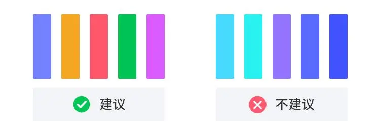

## 2. Obvious contrast, refusing to be confused

Secondly, the selection of colors should not be too similar, and it should be easy to distinguish between data to improve reading comfort. Maintain a certain contrast between the content and the background, facilitating the communication of business information. For a single color scheme, the brightness difference needs to be considered globally, and the brightness span is large enough to display the data more clearly.

When the chart requires fewer colors, avoid using adjacent or similar colors, and try to choose contrasting or complementary colors to make different attribute data more clearly displayed in the chart. When a chart requires a large number of colors, it is recommended not to exceed a maximum of 12 color schemes. Usually, people can distinguish 6-12 different color schemes in discontinuous areas. Too many colors have no effect on conveying data, but rather create confusion.

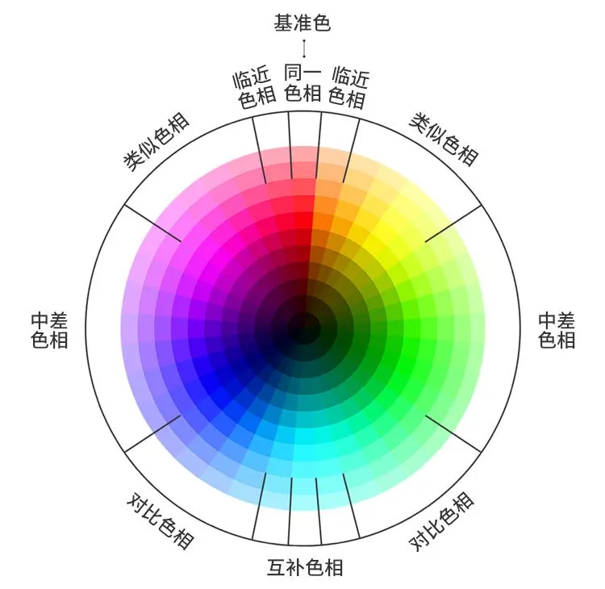

## 3. By convention, semantic palette

Colors not only make visualization "beautiful", but also make it more meaningful and easy to understand at a glance. This requires designers to pay attention to color habits and follow relevant standards. A considerable portion of chart color choices are set according to certain habits, which are so-called conventions, and some even form standards. Such as weather warning color matching, traffic light color matching, and the red rise and green fall of the stock market.

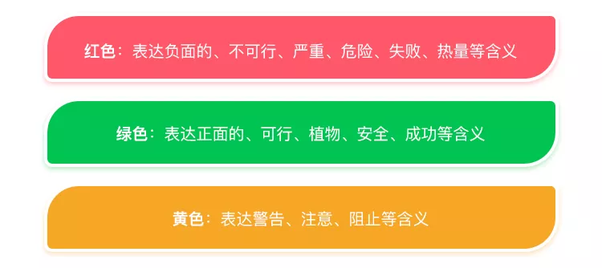

**Popular color scheme: suitable for heavy makeup and light makeup**

If you still don't know what to do after reading the color suggestions above, the following popular colors can provide you with an additional choice and reference, properly transforming into a trendy essence and becoming a fashion leader in the data chart industry.

### Memphis style

This color scheme is inspired by the "Memphis" style, where the data charts emphasize personalization and humor. Suitable for lively and personalized data visualization, leaving a deep impression on your data.

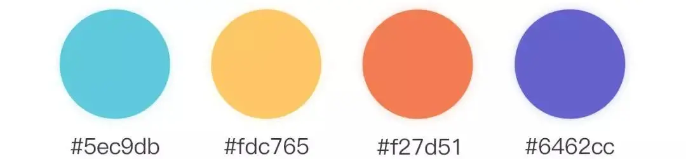  

### Morandi color

The Morandi color scheme has been popular in recent years, with the addition of gray and white tones to the color values used, which can make the data chart more soft and elegant, giving people a sense of stability and atmosphere.

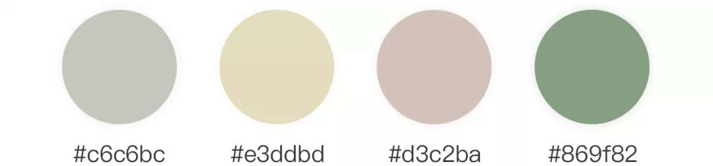  

### Macarone

This color scheme is inspired by "Budapest Hotel", and the agile and jumping colors make people feel better inexplicably; Unlike the Morandi color scheme, the Macaron color data chart has a higher acceptance for younger industries.

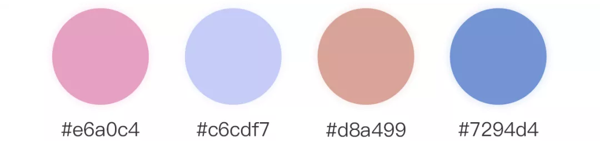  

### Warm color scheme

The recommended color scheme for this color scheme is mainly warm and bright warm colors, supplemented by high-end gray, giving the overall feeling of being clean, dry, and warm.

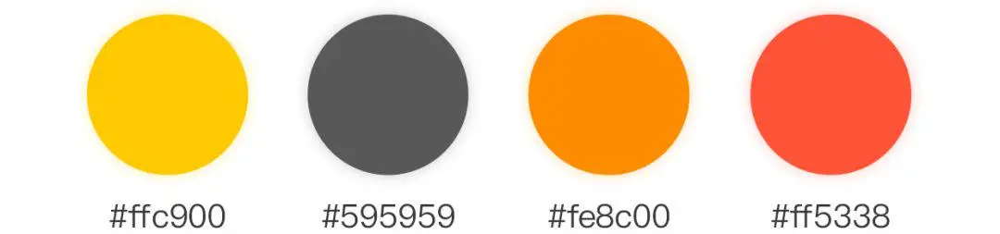  

### Red and blue CP color scheme

Since ancient times, CP has emerged from red and blue, and this scheme uses different shades of red and blue to make the chart look more harmonious and unified.

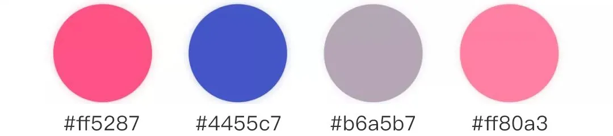  

Also, I would like to recommend a few color matching websites for you to find inspiration when it dries up~

- https://colordrop.io/

- https://coolors.co/palettes/trending

- https://uigradients.com/#Shore

## 4. Industry color matching: broad learning, broad knowledge, specialized and refined

After seeing so many color schemes, each one looks great. Can you apply it to your own visualization scheme? Xiao Yide said, 'Wait a minute, hero!'! After all, each industry has its own unique characteristics and the information it wants to showcase is also different. The industry color scheme that Xiaoyi will introduce below is more meaningful for reference:

### Energy industry

Yixin Huachen has made many outstanding achievements in the energy industry, and has successively conducted data analysis and data governance related projects for units such as National Energy Group, Linkuang Group, Hunan Electric Power, Gansu Electric Power, etc. The energy industries such as coal and electricity are increasingly emphasizing the importance of environmental protection and sustainable development, and choosing a fresh and natural blue-green color scheme is perfect.

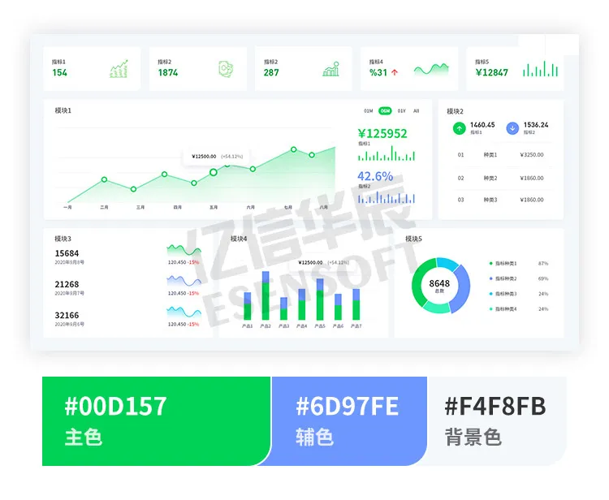  

### Government units

Yixin Huachen has been deeply involved in the government field for more than ten years, including the National Taxation Bureau, Liwan District Government and Data Bureau, and Chancheng District Government and Data Bureau, all of which have good cooperation. The color scheme of government units often focuses on Chinese red, and the warm and harmonious color scheme gives people an atmosphere of happiness, health, and prosperity for the motherland.

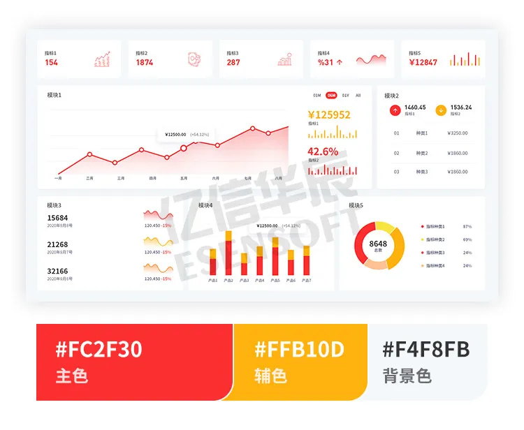  

### The pharmaceutical industry

Yixin Huachen serves the national and local health commissions and drug regulatory bureaus. Health and drug supervision require a healthy and clean color scheme for charts, so we chose more fresh color value samples.

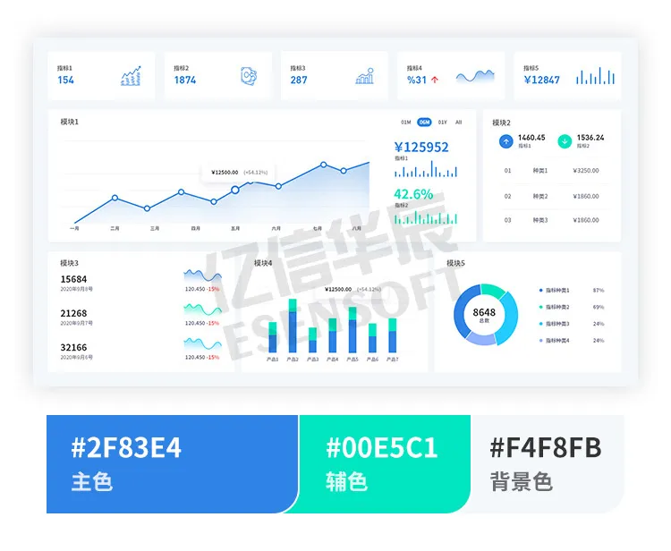  

### Financial industry

It sounds like an industry with a lot of gold, so it is necessary to choose some low saturation chart colors to better reflect its professionalism. We have specially selected a dark background example here to make everyone understand that light and dark colors can be perfectly handled as long as they are well matched. Yixin Huachen has a long-standing presence in the financial industry, including long-term cooperation with the People's Bank of China, Agricultural Development Bank of China, Export Import Bank of China, and China Merchants Leasing.

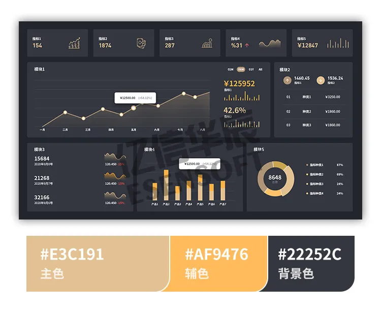  

### Manufacturing industry

The manufacturing industry is currently the main force of digital transformation, and using big data to enhance one's own productivity has always been a key point. The manufacturing leaders cooperating with Yixin Huachen include Toshiba, China Shipbuilding Corporation, China Railway First Group, and so on. The manufacturing industry gives people the impression of being a big brother, requiring the selection of more mature and industrial style chart color schemes.

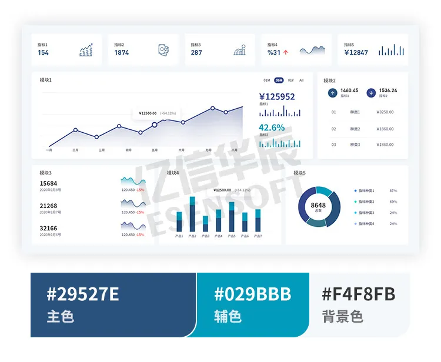  

### E-commerce industry

New retail, e-commerce and other industries need a promotional atmosphere, and when creating charts, consider highlighting marketing data with high brightness and saturation colors. Yixin Huachen has also developed and cultivated in the retail and e-commerce industries for many years, such as Huazhi Liquor Company, Gujia Home Furnishing, Wrigley, DHC, etc., which are all our customers!

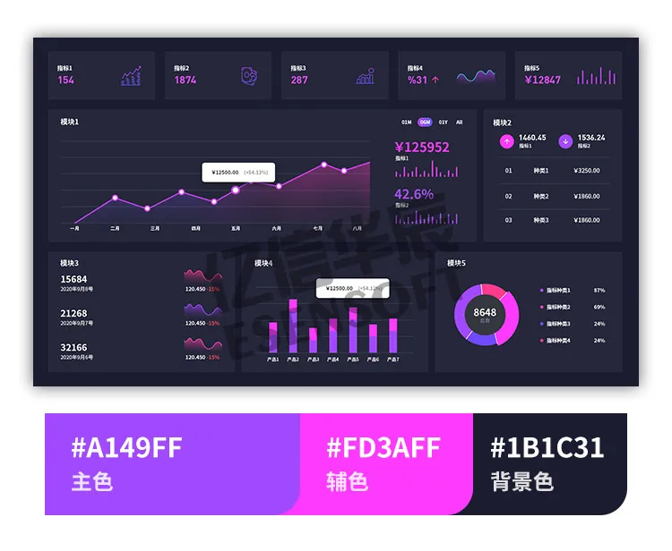  
