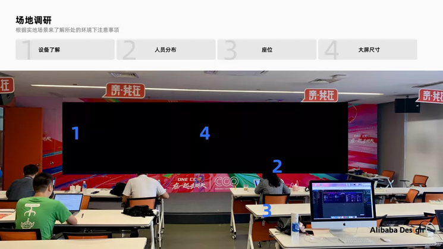
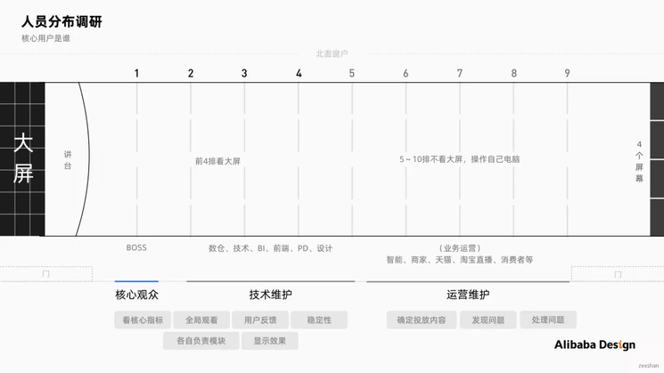
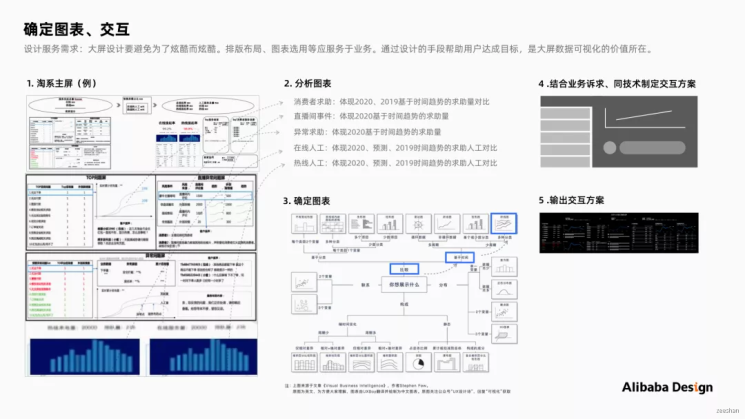
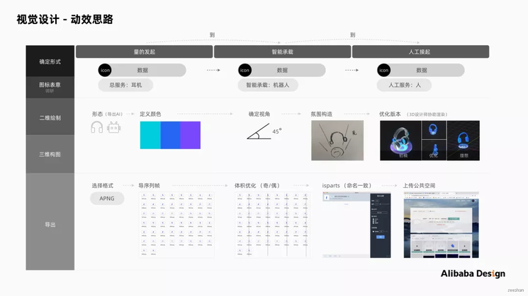
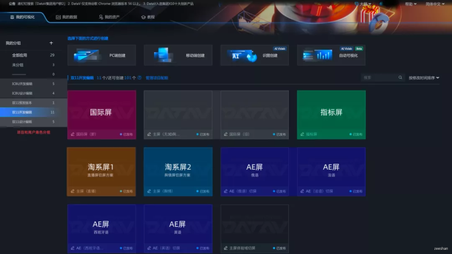
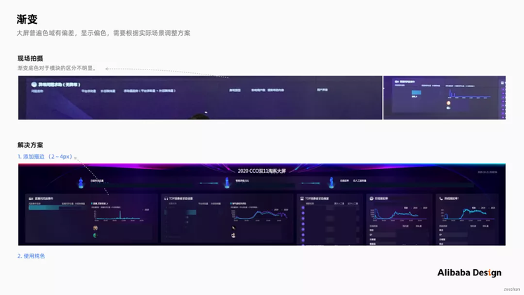
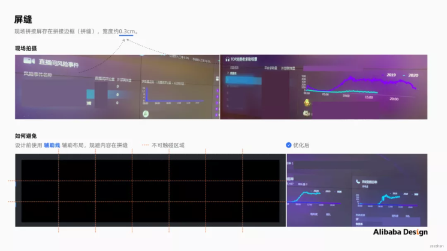
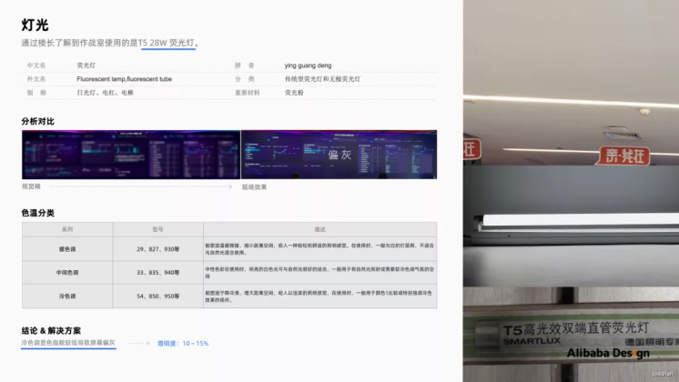
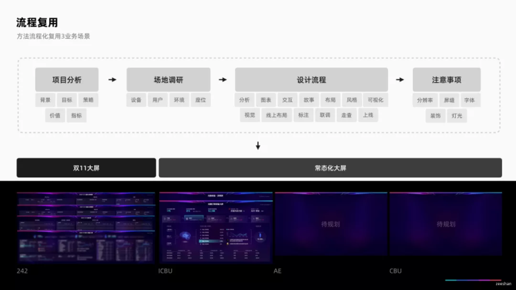
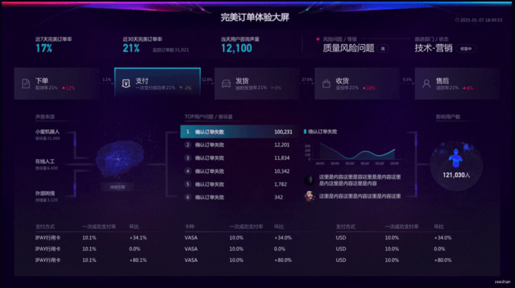

# Tutorial

If you want to do good work, you must first sharpen your tools. With VUE3+Echarts, we also need methodology, standardization, quantitative assessment, continuous transformation of projects, implementation, positive feedback, and continuous innovation. come on:

## Project Analysis

Before hands-on visualization, it is necessary to have a basic understanding of the project.

Suggestions include: business background, purpose, product, placement location, adaptation, user, behavior path, portrait, data source, structure, data extremum, output efficiency, quality, etc., combined with business demands and product objectives to develop design goals.

## Large screen environmental inspection

The investigation of the environment in which the large screen is located is crucial for the entire design process.

Suggest paying attention to: devices, large screen locations, user roles, and seat distribution.

### Equipment

Screen hardware equipment is a necessary prerequisite for design display, and currently commonly used in the market include LED screens and splicing screens. After clarifying the use of splicing screens in the venue, I summarized the advantages, disadvantages, and resolution of splicing screens. The most important concern in design is the screen gap issue (0.3cm).

### User distribution

Through research and understanding, restore the distribution of personnel on the site and determine core users. The boss mainly focuses on core indicators and user voices; Data warehouse, development, technology, PM, and product students focus on the stability and display of large screens, while business mainly focuses on the accuracy of large screen data.

### Seating

The optimal visual range of the area determines the reasonable layout of the seats. So as to provide students with reasonable layout suggestions for arranging seats.

### Design process

Designing large screens often serves business needs and helps users achieve their goals through design methods. Alibaba Design has summarized 9 key points of big screen design for you.

### Content analysis

When the visualization workload is large, It is recommended to prioritize the project and prioritize it from the most important, least important, and uncertain aspects.

### Storyline

The dynamic content displayed on the large screen is the first perception of users, and telling them a story needs to be divided based on business demands. The general structure is first general and then general. That is, first reflect the core link (what story to tell), and then describe the details.

### Layout framework

### Select Chart

Charts are the visual highlights of the entire large screen, which can help users express data information faster and more intuitively. Usually includes basic charts and mixed charts. Basic charts include: comparison class, proportion class, interval class, association class, trend class, time class, map class, etc. A mixed chart refers to the interrelated form of multiple basic charts. The following summarizes the processes used for two types of charts:

A. Basic Chart

-Determine the content: Clarify the core information to be conveyed using charts. Example: Reflect the comparison of help-seeking volume based on time trends between 2020 and 2019.

-Judgment relationship: Determine the type of comparison between data. Example: Line chart.

-Select Type: Select the chart with the corresponding meaning. Example: Line chart.

B. Mixed Chart

-Determine the demand: Reflect the interaction and linkage relationship of information in multiple charts. Example: Reflect the comparison of customer complaint volume trends and corresponding user voices for multiple issues in 2020 and 2021.

-Select Type: Select the chart with the corresponding meaning.

-Develop a plan: Develop an interaction plan based on business demands and technology.

### Define Style

Defining Visual Style - A Mood Board refers to a collage of a series of images, text, and samples, which is a commonly used way of expressing design definitions and directions. The method is to investigate native keywords - brain burst derived keywords - search for image styles - extract emotion boards - analyze visual styles.

### Kinetic effect

For users, the large screen performance is easy to understand and reduces cognitive costs; Enhance the sense of immersion and enhance the user experience. Dynamic effects prioritize meeting core content and storylines. Common large screen effects - display type, used to highlight the core functions and characteristics of the product. The interface information is presented in a certain pattern, guided by visual flow.

For example, highlighting the data flow from "quantity initiation" to "intelligent carrying" to "manual pickup".

Note: 3D dynamic effects are becoming increasingly common in the use of large screens, but excessive 3D coolness and shock can also lose the original intention of visualizing large screens - the transmission of data information. Therefore, when using 3D, students should focus on the transmission of information and highlight the key points of information in their use.

### Color

American scholar Noah Ilinsky summarized in "The Beauty of Data Visualization" that there are four main elements of visual aesthetics - novelty, richness, efficiency, and aesthetics. How to use colors to visualize a large screen, both aesthetically pleasing and highlighting key points. The summary includes the following points:

-Color matching is easy to identify and distinguish: use colors with significant differences in hue and brightness for combination.

-Comparison of warm and cold colors and complementary colors: In data charts, using warm and cold colors and complementary colors can generate strong contrast and highlight key information.

Case:

### Font

Generally, for large screen design and development, the system default font is preferred, and DIN is recommended for numbers. Although special fonts can also be embedded in the development program through font packages, they should be avoided as much as possible due to implementation costs.

The font size needs to be selected based on the actual site, using the following methods: user optimal visual distance - on-site font size testing - user research - output specifications. Four steps to verify.

### Build

At present, third-party development tools on the market include Datav, Vshow, Tencent Cloud Map, Baidu AI Cloud, etc. Choose Datav (a drag and drop visualization tool produced by Alibaba Cloud) to build, WYSIWYG, and standardize the large screen editing permissions: design and development, making it easy for technical students to debug.

## Acceptance precautions

Visual design is a long and arduous task, and large screens are a long-term follow-up process. Many details can only be discovered during the acceptance process. Here are two aspects to share: the product effect and the external environment.

### Hardware effects

#### Display

There are deviations in the display effects of different devices, and it is necessary to fine tune the online effects based on the actual scene. Suggest fine-tuning the saturation.

#### Gradient color difference

Gradient is very unfriendly to online visual presentation. In cases where gradient is used for module base colors, the dark gradient area is basically difficult to see clearly, and the module differentiation is not obvious. Suggest adding edges or solid colors here.

#### Screen gap

The biggest design issue with splicing screens mentioned above is the screen gap issue (0.3cm). Before layout, it is recommended to use auxiliary lines to assist layout and avoid information being trapped in screen gaps.

#### Font

If encountering the loss of large screen fonts, the common reason is that the projection computer does not have a complete font package installed. It is recommended to import the font package used into the projection computer and set the default font in the computer browser after completing the large screen vision.

#### Number of characters

When delivering the design proposal, it is recommended to label the extreme values of the data characters displayed on the large screen for the convenience of developers setting the number of characters and subsequent follow-up checks.

#### Resolution

The design draft size cannot be defined with a large screen resolution. In practical cases, the splicing screen resolution is 13440 (1920 * 7) * 3240 (1080 * 3). When the design draft is selected as 13440px, the images cannot be loaded.

Practical suggestions:

-When the large screen is at a single computer resolution, the design draft can remain consistent. Example: 1920 * 1080, 1920 * 1200.

-When the large screen is at a super high resolution, use proportional reduction of resolution. But on-site testing is required to ensure that the large screen display is normal. Example: 13440 * 3240, with a drawing size of 4480 * 1080.

#### APNG

The commonly used animation formats for large screens are usually gif and apng. We recommend using apng here. The reason is that the gif format has a fatal weakness, with very limited support for transparent channels, resulting in poor output results with jagged or white edges. The apng format can be perfectly supported on all mainstream browsers and perfectly supports transparent channels.

Production process:

-Use software such as AE to create animations and output png sequence frames.

-Import the "png sequence frame" into iSparta (apng image converter), set the path, and output it.

(Note: The names of sequence frames should be consistent, and the number of frames should not be too large to avoid APNG generation failure)

### External environment

#### Lighting

At present, in the market, the most common types of light bulb lighting are white and warm yellow. When placing large screens, it is necessary to consider the properties of the lighting. Different color temperatures can cause visual deviation when placing large screens. Suggest fine-tuning the brightness to improve.

#### Decoration

The venue usually has some decorations and atmosphere background. It is necessary to consider that the large screen is not affected by the surrounding atmosphere and decorations. Example: The complex background atmosphere during on-site inspection interferes with the large screen information; The hanging tag is too high to block the view of the large screen.

## Standardization

I have encountered a large number of visualization demands in my work, and by standardizing visualization measurements, I can better verify whether I am doing well or not. Process standardization and componentization can better improve project efficiency.

### Standardized process

A universal process for designing large screens, it is recommended to deposit method documents (such as Yuque), or synchronize the design process with the product and PM.

### Style Componentization

When different businesses have the same demands, common styles can be componentized. Designs that can be refined include: character count, rotation seconds, tab style, atmosphere map, dynamic effects, etc., ultimately reusing multiple services horizontally.

Empowerment case:

### Measurement standardization

Referring to Antv's extensive project practical experience, the four core design principles for visualization are summarized: accuracy, clarity, effectiveness, and beauty. To break down the visualization measurement indicators, the following descriptions are summarized:

-Accurate: This product accurately expresses the characteristic information of the data, and the provided data is accurate and useful to me. eleven thousand five hundred and fifteen

-Clear: This product can clearly express the story and understand the meaning of each piece of content at a glance.

-Effective: This product conveys useful information to me and meets my business needs.

-Beauty: This product has a beautiful design style.

