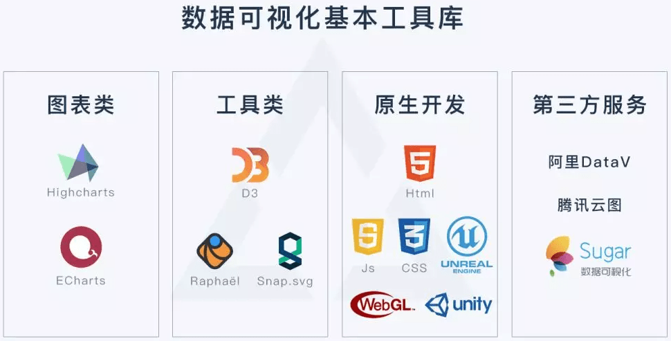
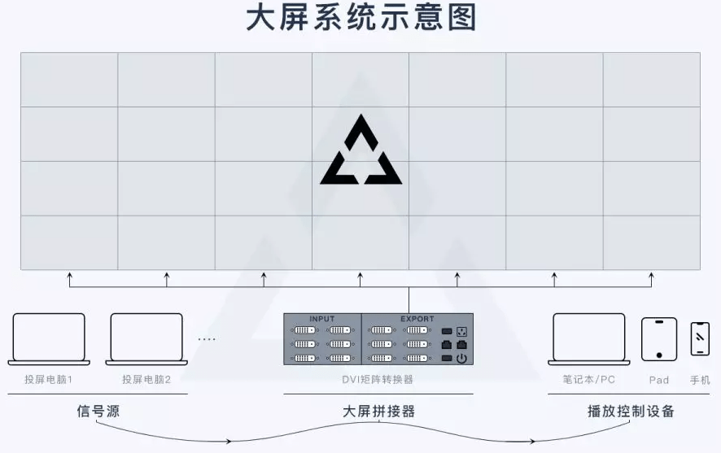
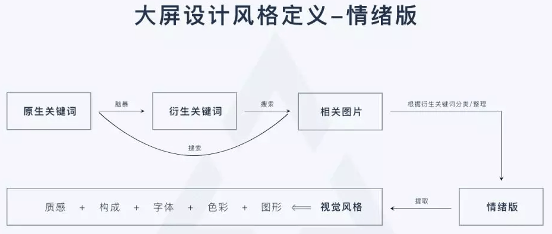

# Large screen design process

A standardized process is the guarantee of good results. By finding a reference process and taking it step by step, we can avoid many unnecessary rework and ensure design quality and project progress.

## 1. Extract key indicators based on business scenarios

Key indicators are general terms that refer to a group or series of data. In general, an indicator occupies an exclusive area on a large screen, so by defining key indicators, we can know what content will be displayed on the large screen and how many blocks the screen will be divided into. Taking the shared bicycle electronic fence monitoring system as an example, the key indicators here include: enterprise parking time, enterprise parking violations, hot parking violation areas, vehicle entry rate, etc.

After determining the key indicators, determine the priority (primary, secondary, and secondary) of each indicator display based on business needs.

## 2. Establish indicator analysis dimensions

When viewed horizontally, there are peaks on the side of the mountain. The data of the same indicator will have different results when analyzed from different dimensions. Many children have completed visual design and found that the visual graphics do not accurately express their intentions or convey the necessary information to the audience. The visual graphics are confusing or incomprehensible. This situation is largely due to the lack of accurate dimensionality or confusion in the definition of the analysis.

The above figure shows you the four commonly used dimensions for data analysis. After selecting the indicators, we need to discuss with other project team members what our indicators mainly want to show you. Furthermore, what rules and information we want to express through visualization. The above figure can guide us to think more logically about this issue from the four dimensions of "connection, distribution, comparison, and composition".

**Connection * *: Correlation between data

**Distribution * *: What range and patterns are the data in the indicators mainly concentrated in

**Comparison * *: What are the differences between data and what are the main aspects of the differences

**Composition * *: What are the components of the data in the indicator and what is the proportion of each component

## 3. Select a visualization chart type

After determining the analysis dimensions, in fact, the types of charts we can choose are basically determined. Next, we only need to select the one that best reflects our design intent from a few charts.

Precautions for selecting charts: easy to understand and achievable;

### Easy to understand

Visualization design should consider the large screen end user, and the visualization results should be easy to understand without the need for thinking or excessive understanding. Therefore, when selecting charts, it is important to be rational and avoid selecting graphics that are not very user-friendly for visual effects.

### Realizable

1. We need to understand the information, scale, characteristics, connections, etc. of existing data, and then evaluate whether the data can support the corresponding visual representation

2. We need to develop a graphical chart that can be implemented. In practical work, some visual effects are easy to implement and have good results when developed in code, but designers may find it difficult to simulate these effects using tools such as Ps/Ai/Ae; Similarly, some effects can be easily achieved by designers using design tools, but it is very difficult to develop with code implementation. Therefore, it is important to communicate with developers in large screen design. We need to clarify which areas designers can fully utilize and which areas need to be carefully designed! A project always has cycle and budget constraints, and will not modify and iterate indefinitely. Therefore, designers need to focus on the key points, have trade-offs, and not be overly focused or stubborn.

## 4. Understand the physical screen and determine the size of the design draft

**In most cases, the resolution of the design draft is the resolution of the signal source computer screen that is projected to the large screen** When there are multiple signal sources, there will be multiple design drafts, and the size of each design draft corresponds to the resolution of the signal source computer screen

In general, the resolution of the design draft is the resolution of the computer. When there are multiple signal sources, sometimes the computer screen resolution is customized through the graphics card, so that the computer display resolution is not equal to its physical resolution. In this case, the corresponding resolution of the design draft becomes the set resolution** In addition, when the aspect ratio of the resolution of the invested computer is inconsistent with the physical aspect ratio of the large screen (single signal source), custom adjustments will also be made to the screen resolution of the invested computer, and in this case, the design draft resolution will also change. So it is important to understand the physical aspect ratio of the large screen before the design starts**

## 5. Page layout and partitioning 

After the size is established, the next step is to layout and divide the design draft into pages. The division here is mainly based on the business indicators we have previously set, with core business indicators arranged in the middle and occupying a larger area; The remaining indicators are expanded around the core indicators in order of priority. Generally, related indicators are placed adjacent or close, and indicators with similar chart types are placed together to reduce the cognitive burden on viewers and improve the efficiency of information transmission.

## 6. Define design style

Many friends may not have been exposed to large screen design work, but most people should have experience defining app or web styles. What are the commonly used methods when defining an app or web page design style** Emotional version**

Although the large screen is cool, it is actually a web page running in a browser. Therefore, the method for defining the design style of the large screen can also be done using the emotional version, which is currently a relatively scientific and efficient way to define the style

The above image provides a brain map of the emotional version application. The specific operation details will not be introduced, and friends who are not familiar with it can search for information on their own.

From the emotional version of the process, the style we define is basically scientific and accurate, which can guide us in executing the design. If it is to create a large screen for the father of Party A, this process can also make our proposed plan more convincing

## 7. Visual design

Conduct a reasonable visual design based on the defined design style and selected chart types. Currently, there are two main visualization data types for large screen visualization: indicator information points and geographic information points. The visualization effect of indicator information points is relatively simple and easy to achieve, while the visualization effect of geographic information points is generally cool, but development is relatively difficult, requiring designers to communicate with developers more. Geographic information generally has strong spatial sense, rich particle and streamer effects, high-precision models and materials, and interactive real-time calculations. Therefore, there are requirements for the performance of hardware devices such as projectors and large screen splicers. In the case of insufficient hardware configuration, there may be situations of stuttering or even crashing, so this also requires early communication and evaluation.

## 8. Sample communication and confirmation

The communication here is divided into three levels: internal communication among designers, external communication among designers, and "communication" between designers and large screens.

In the communication process of the sample image, the initial sample image does not need to be very refined. We can understand it as a "low fidelity" prototype, and then through continuous communication and modification, gradually improve and refine it, that is, take small steps and run quickly to avoid the situation where we suddenly reach the end and then make major repairs and changes.

Because we have already determined the page layout, chart type, and page style characteristics in the previous steps, we need to use as simple a method as possible to quickly reflect the results of the previous steps on the page, and then try to determine five aspects based on the sample image effect:

**1. Is the previously established layout still suitable after incorporating the design content**

**2. Is the established chart type still objective and accurate when brought into the data**

**3. Does the page style created based on key elements, colors, structure, and texture convey the expected atmosphere and feeling**

**4. Are there any issues with the development and implementation of existing styles, data content, and dynamic effects**

**5. Whether there is color difference on the large screen, whether the text content is clear and visible, and whether the page is deformed or stretched**

**Communicating with a large screen is both an important and a special aspect**, which is why I think the design of a large screen is different from other designs. A large screen has its own unique resolution, screen composition, color display, and operation and display environment. Many problems here can only be discovered when the design draft is submitted to the large screen. Therefore, this step is very important in the sample communication and confirmation process, and sometimes it is necessary to develop a demo, Repeated testing multiple times.

## 9. Page finalization and development

In fact, the page development stage is not at this stage. The page development mentioned here only refers to the implementation of the front-end style. In fact, the backend data preparation work has already started after defining the analysis indicators. Our current work is to connect the data to the front-end and present it in the designed style.

**Cutting and labeling**

Due to the fact that a large screen is actually a web page, cutting and annotation during the development phase are essential.

**Cut: Which elements need to be cut and how**

Generally, styles or animations that cannot be written using code for development require support from designers, such as data container borders, small animations, overall page backgrounds, and partial icons. Cut the image according to normal webpage design standards.

**Annotation**

Everyone is familiar with what plugins to use for annotation on web pages, so I won't go into more detail. It should be noted that if the large screen page needs to be displayed on different proportions of terminals, the annotation and development at this time can be achieved using * * rem * * as the basic unit, which will result in better scalability and adaptability of the large screen page in the later stage.

## 10. Overall details tuning and testing

This section refers to the testing and optimization of placing real pages on a large screen after page development is completed. There are mainly two parts of work here.

**Visual testing** (somewhat similar to the UI walkthrough of an app): whether key visual elements, font size, page dynamics, graphic charts, etc. are displayed as expected, and whether there are any deformation, misalignment, etc.

**Performance and data testing**: Check whether the graphics, charts, and animations are smooth, and whether there are any abnormalities in data loading and refreshing; The page displays for a long time whether there are situations such as crashing or getting stuck; Can the backend control system switch to front-end page display normally.

