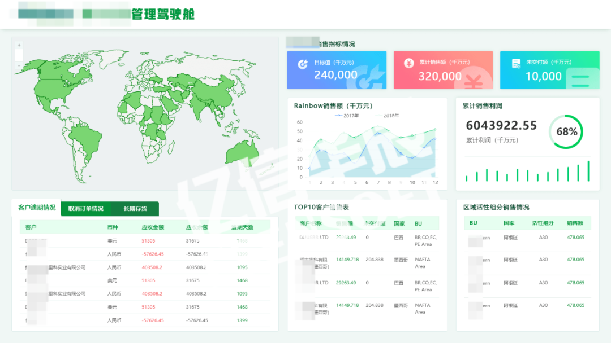

# QuickLearn

## Create Project

::: tip tips
Refer to 'Environmental Deployment'
:::

## Init Project

In directory /src modify file 'app.vue'：
```html
<template>
  <div id="app">
    <router-view/>
  </div>
</template>

<style lang="scss">
  html,body,#app{
    width: 100%;
    height: 100%;
    padding: 0;
    margin: 0;
  }
</style>
```

In directory /src/views modify 'HomeView.vue'：
```html
<template>
  <div class="home">

  </div>
</template>

<script>

export default {
  name: 'HomeView'
}
</script>
```
In directory /src/router modify 'index.js'：
```js
import { createRouter, createWebHashHistory } from 'vue-router'
import HomeView from '../views/HomeView.vue'

const routes = [
  {
    path: '/',
    name: 'home',
    component: HomeView
  }
]

const router = createRouter({
  history: createWebHashHistory(),
  routes
})

export default router
```
::: tip tips
Delete file of /src/view/About.vue
Delete directory of /src/components/HomeView
:::

## Build a DIV framework according to the design drawings


::: tip tips
Require artists or designers to provide design drawings and related materials (screen size, layout, length, width, padding, margin, font, size, color, SVG icon, etc.)

Suggest screen design according to 3840px * 2160px
:::



Building div frameworks


## Add Component
::: tip tips
Add Component in every div
:::

## Interface optimization
::: tip tips
Optimize the interface according to the design diagram
:::

## Access Data
::: tip tips
Access business data according to component data format
:::

## Big screen adaptation
::: tip tips
Accessing the big screen and adapting to the environment
:::

## Project Release


* [echarts](https://echarts.apache.org/zh/) 
* [山海鲸Visualization](https://www.shanhaibi.com/)
* [四方伟业](http://www.sefonsoft.com/) 
* [The data of the map](http://datav.aliyun.com/portal/school/atlas/area_selector)
* [Baidu Coordinate recognition](https://api.map.baidu.com/lbsapi/getpoint/index.html) 
* [ECharts reference](https://echarts.apache.org/handbook/zh/concepts/style/#echarts-%E4%B8%AD%E7%9A%84%E6%A0%B7%E5%BC%8F%E7%AE%80%E4%BB%8B)
* [Echarts Theme Editor](https://echarts.apache.org/zh/theme-builder.html)

* openlayers
https://www.jianshu.com/p/4af2a52a0fc6
https://www.cnblogs.com/nscqbc/p/3466919.html 
https://chenjiamian.github.io/OpenLayers-3.x-Cookbook-Doc/# 
https://blog.csdn.net/u011435933/article/details/80439510 

* [Gallery](https://www.isqqw.com/homepage#/homepage)
* [curved surface](https://blog.csdn.net/qq_20042935/article/details/89876921)
* [Online tools](https://tool.lu/)


A downsampling strategy for line graphs when the data volume is much greater than pixels ,https://echarts.apache.org/zh/option.html#series-line.sampling
https://github.com/ecomfe/awesome-echarts


vue 2
vue create xxx
vue add element

description|attribute|parameter
:---:|---|---
flex layout|display|flex 
flex direction|flex-direction|row/column
The position of the main pump|align-items|flex-start/flex-end/center
Alignment on the main drawing
|justify-content|flex-start/flex-end/center/space-between/space-around/space-evenly
Sub element flex attribute (obtaining remaining area)|flex| 1
Sub element flex attribute (defines the width of the div arranged horizontally)|flex|0 0 widthpx

### open flex
```html
* display: flex // Default horizontal (main axis) direction arrangement, blocks
* display: inline-flex  // Inline block
```

### flex-direction // Set the overall arrangement direction of sub elements 
```css
flex-direction: row // Default, horizontal direction, right
                row-reverse // Horizontal direction reversal, left
                column  // Vertical direction, downward
                column-reverse // Vertical direction, upward
```
                
### flex-wrap // Set whether sub elements wrap 
```css
flex-wrap: nowrap // default
           wrap  
           wrap-reverse 
```
           
### flex-flow // Simultaneously setting the direction of the flex layout and whether to wrap
```css
flex-flow: row // row Horizontal direction, right
           row-reverse // Row reverse horizontally, to the left
           column  // Column vertical direction, downward
           column-reverse // Column reverse vertical direction, upward
           nowrap // does not wrap
           wrap  
           wrap-reverse // Wrap reverse Wrap up
```
           
### justify-content
```css
justify-content: flex-start // default
                 center 
                 flex-end 
                 space-between 
                 space-around 
                 space-evenly 
```
                 
### align-items
```css
align-items: stretch // default stretch, will be invalidated when the height of child elements is set
             flex-start 
             flex-end   
             center     
             baseline   
```

### align-content(items greater than or equal to 2 rows take effect)
```css
align-content: stretch // default
               flex-start    
               flex-end      
               center        
               space-between 
               space-around  
               space-evenly  
```

###   order
```css
order: 0 // default The smaller the number, the more elements will be arranged in front
```

### flex-grow
```css
flex-grow: 0 // default
           1 Allocate all remaining space. If only one 1 is set, allocate the remaining space
             If the sum set is greater than 1, the sum of all remaining space/flex grow will be allocated proportionally
             If the sum set is<=1, it will be allocated proportionally according to the remaining space
```
             
### flex-shrink
```css
flex-shrink: 1 // default
             0 // without shrink

```
             
### flex-basis
```css
flex-basis: auto // default
            xxpx;
```
            
### flex
```css
flex: flex-grow flex-shrink flex-basis
      0 1 auto // default
      none ==> 0 1 auto
      auto ==> 1 1 auto
      Without units, it means flex grow, with units, it means flex base
      1 Average seperate
      120px ==> 1 1 120px
      1 1 ==> flex-grow flex-shrink
      1 120px ==> flex-grow flex-basis
```
      
### align-self
```css
align-self: auto // default，inherit align-items
            flex-start 
            center     
            flex-end   
            baseline   
            stretch    
```    
      


             


                 


                

                


