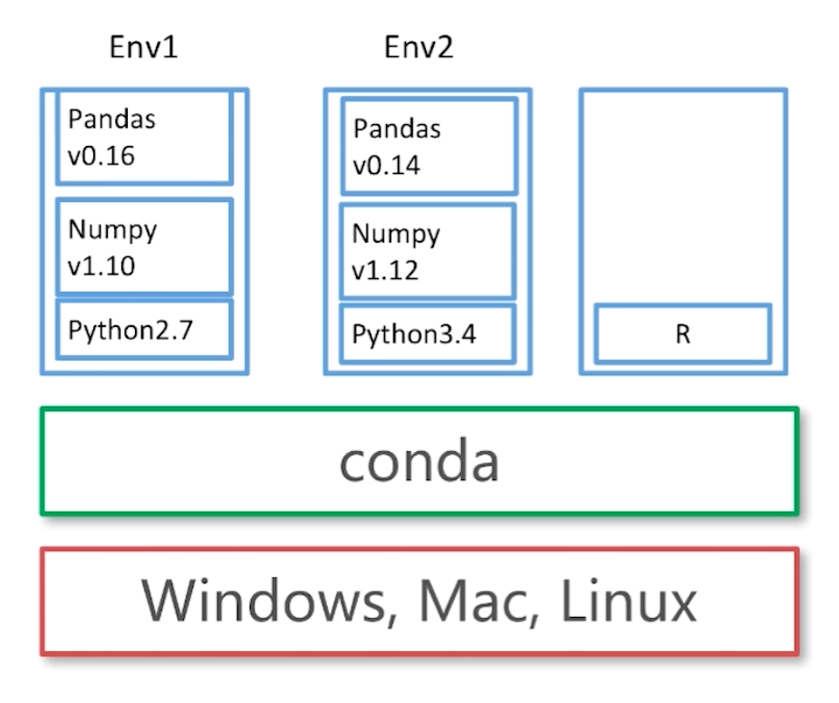

# Conda environment management

## 1 Conda environment management
### 1.1 create a new environment
* conda create --name pyton34 python=3.4

### 1.2 activity the environment
* activate python34 # for Windows
* source activate python34 # for Linux & Mac

### 1.3 quit the environment
* deactivate pyhon34 # for Windows
* source deactivate python34 # for Linux & Mac

### 1.4 delete the environment
* conda remove --name python34 --all

## 2 Conda package management
### 2.1 install Python package
* conda install numpy

### 2.2 list Python Package
* conda list
* conda list -n python34 # check Python modules

### 2.3 delete Python Package
* conda remove -n python34 numpy