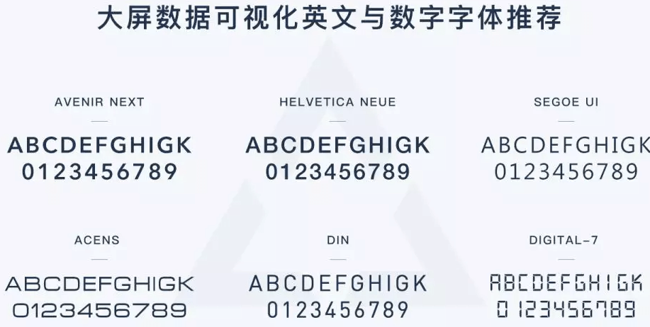
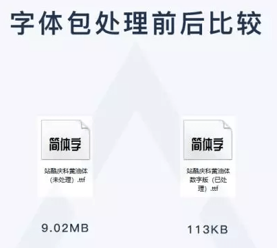
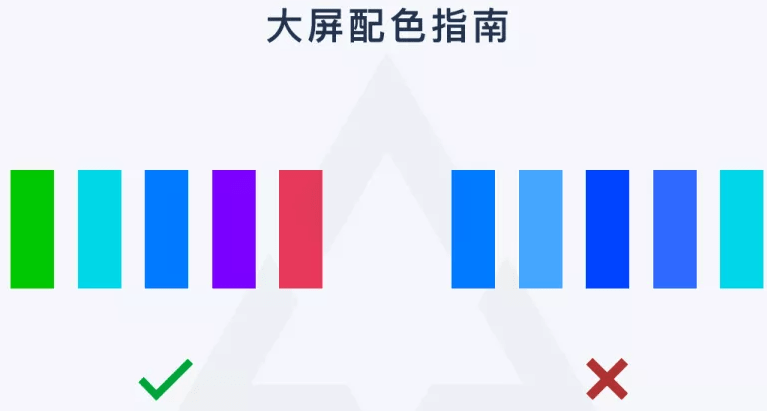

# 大屏设计的注意事项

## 1、字体使用

字体优先使用系统默认字体，需要嵌入字体时考虑字体的可识别性、与当前设计风格是否融合、是否可免费商用。

如果页面是云端部署，需要嵌入字体包时，我们可以使用**FontCreator**这类的软件把那些用不到的字符从字体包中删掉，然后重新打包上传，减小字体包大小，可以优化页面加载体验，避免在替换默认字体的过程中出现页面文字跳动等现象。（一般来讲一套字体文件包含了阿拉伯文、符号、拉丁文、日文、西里尔文、希腊文、拼音、注音符号等多种字符，对于大屏这个明确的场景，我们可以删掉其它使用不到的字符，仅保留中文、拼音和数字）

关于字体版权获取相关问题，公众号回复“可视化”获取

## 2、颜色搭配

 1、**色彩明度与饱和度差异显著**、对比鲜明， 尽量避免使用邻近色配色

2、使用深色暗色背景：深色暗色背景可减少拼缝带来的不适感。由于背景面积大，使用暗色背景还能够减少屏幕色差对整体表现的影响；同时暗色背景更能聚焦视觉，也方便突出内容、做出一些流光、粒子等酷炫的效果，

3、渐变色慎重使用：大屏普遍色域有偏差，显示偏色，因而使用渐变色需要根据大屏反馈确定是否调整，纯色最佳。

## 3、页面布局

主次分明、条理清晰、注意留白，合理利用大屏上各小的显示单元，并尽量避免关键数据被拼缝分割

