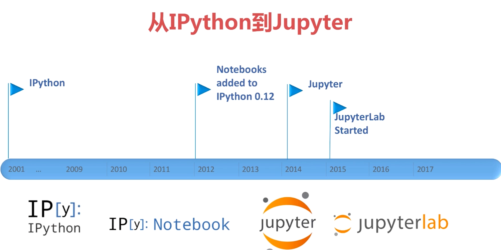

# Jupyter是什么

Jupyter是一个开源的交互式计算环境，最初是作为IPython项目的一部分，后来发展成为支持多种编程语言的交互式计算工具。名称“Jupyter”是对三种主要编程语言的缩写，即 Julia、Python和R，这反映了Jupyter最初是为这三种语言而设计的。

Jupyter的核心是Jupyter Notebook，它提供了一个基于Web的交互式界面，用户可以在其中编写和运行代码、创建文档、可视化数据，并与其他用户共享笔记本。Jupyter Notebook支持多种编程语言，包括Python、R、Julia等，并且可以通过内核（kernel）扩展支持更多的编程语言。
