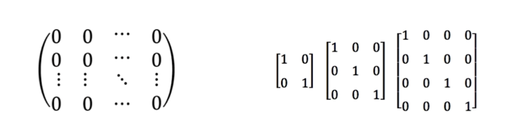
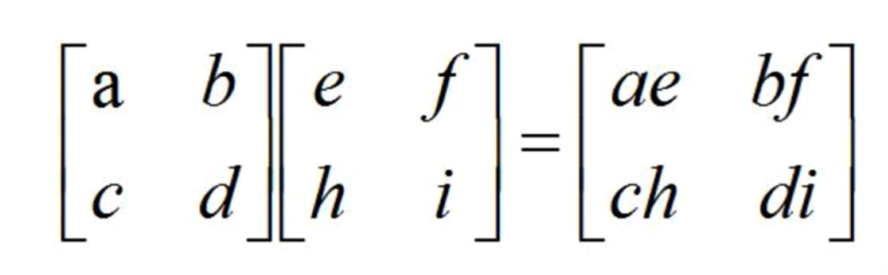
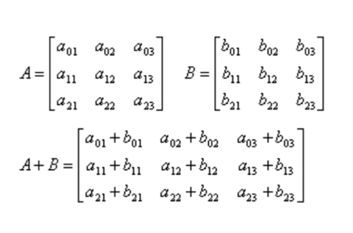
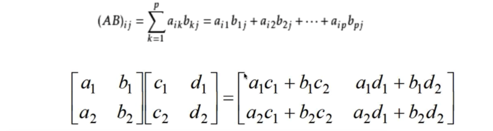

# 计算

## 基本概念

* 矩阵：矩形的数组，即二维数组，其中向量和标量都是矩阵的特例
* 向量：是指1xn或者nx1的矩阵
* 标量：1x1的矩阵
* 数组：N维的数组，是矩阵的延伸

## 特殊矩阵
* 全0全1矩阵
* 单位矩阵

## 矩阵加减运算
* 相加，减的两个矩阵必须有相同的行和列
* 行和列对应元素相加减

## 数组乘法（点乘）
* 数组乘法（点乘）是对应元素之间的乘法

## 矩阵乘法
* 设A为mxp的矩阵，B为pxn的矩阵，mxn的矩阵C为A与B的乘积，记为C=AB，其中矩阵C的第i行第j列元素可以记录为：
