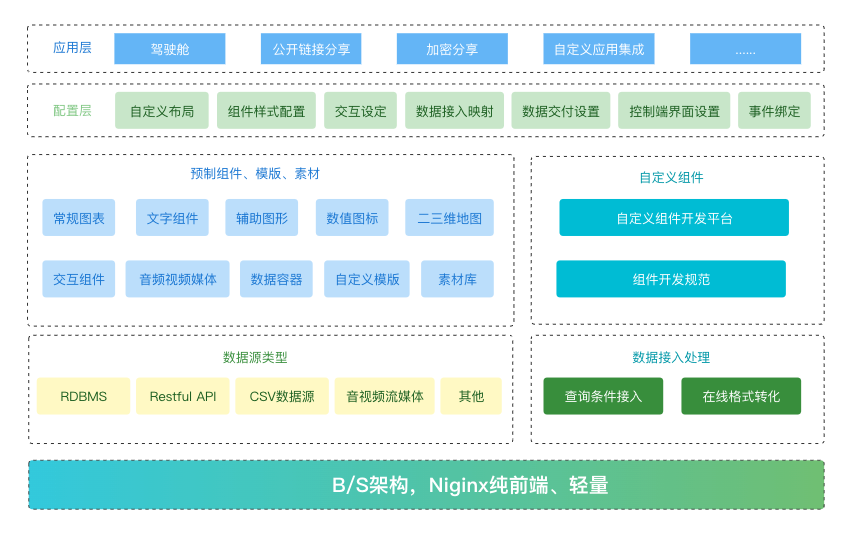

# 数据可视化

* NtDatav基于Echarts的微代码开发平台,适用于任何WEB项目
* 简单, 敏捷, 高效,通用化, 高度可定制化, 让你的项目瞬间档次提升
* 完全真正打通前后端, 支持图形数据联动,筛选,钻取, 支持几乎常见的所有数据库
* 积木式的开发模式, 开箱即用, 安装简单, 依赖少, 适应各种平台
* 可高度定制化

# 架构图

# 系统需求

* JDK >= 1.8
* MySQL >= 5.7
* Maven >= 3.0
* Node >= 12
* Redis >= 3

# 应用场景
NtDatav不仅是一个工具，它是一个完整的企业级商务智能解决平台。NtDatav可以让企业更好的利用大数据、云计算等的优势，进行数据建模、数据分析和数据可视化，实现数据辅助决策。
       
**政务场景：** 利用大数据商业智能是实现数字化智慧城市转型的关键，结合物联网信息，可以更快更优的管理城市的交通信息、民生信息、医疗信息、社保管理、疫情数据监测、党政培训管理、园区信息等。实现资源的最优分配，辅助政府部门进行公共管理，利用数据科学决策。

**金融场景：** 可以应用于营销、风控、财富管理等方面。包括对客户画像，提升客户价值，客户关系管理，绩效管理，风险控制信用等级评分，精准营销，反欺诈反洗钱等应用场景。

**零售场景：** 可以应用于顾客行为分析，成本控制，库存管理，供应商管理，商品销售分析、盈利分析及预测等。应用 NtDatav 可帮助实现业务增长，降低成本，提高市场占有率。

**医疗场景：** 通过分析患者的健康信息，住院信息，医生的诊疗信息，手术数据，康复信息，药品信息，医疗器械信息，财务数据，从而提高患者康复，帮助医院提高运营效率和监管质量。

**工业场景：** 可以应用于库存管理，生产效率和产品合格率的分析和预测，销售和订货信息的管理，产品质量管理，根据掌握的数据分析经销商和客户的情况以及优化生产线、改善业务运营。

**教育场景：** 可应用于教育经费管理，学生成绩分析及预测，教师教学质量及授课情况分析和统计，学生素质技能分析，学校运行监测等。以此提高学生的综合素质和辅助学校运营管理。
