# 教程
工欲善其事，必先利其器。有了VUE3+Echarts，我们还需要方法论，需要规范，需要量化考核，需要不断转化项目，需要实施，需要正向反馈，需要不断创新。加油⛽️

## 项目分析

动手做可视化之前，需要对项目有一个基础的了解。

建议包括：业务背景、目的、产品、投放位置、适配、用户、行为路径、画像、数据来源、结构、数据极值、产出时效、质量等，再结合业务诉求和产品目标制定设计目标。

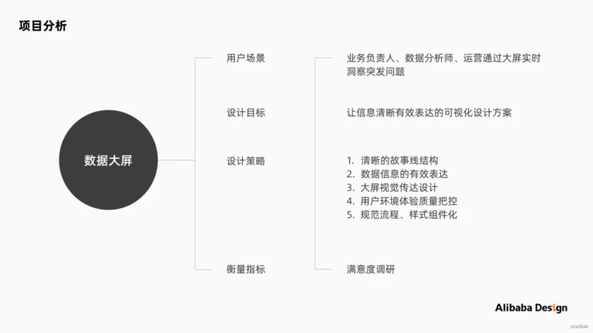

## 大屏环境考察

大屏所处环境的调研，对整个设计流程至关重要。

建议关注：设备、大屏位置、用户角色及座位分布。

### 设备

屏硬件设备是设计展示的必要前提，目前市场较常用的有：LED屏、拼接屏。在明确场地使用拼接屏后，我总下拼接屏的优缺点及分辨率。其中设计最重要关注为屏缝问题（0.3cm)。

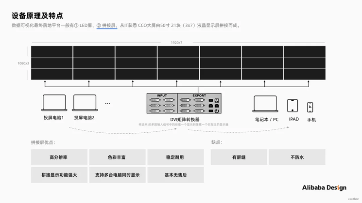

### 用户分布

通过调研了解，还原场地人员分布情况，确定核心用户。老板主要关注核心指标、用户声音；数仓、开发、技术、PM、产品同学关注大屏稳定性和显示情况，业务主要关注大屏数据的准确性。

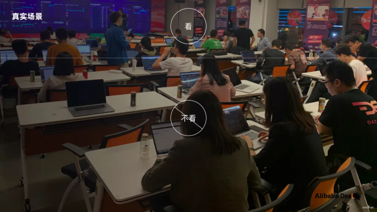

### 座位

所在区域的最佳可视范围，决定座位的合理布局。从而给到安排座位同学合理的布局建议。

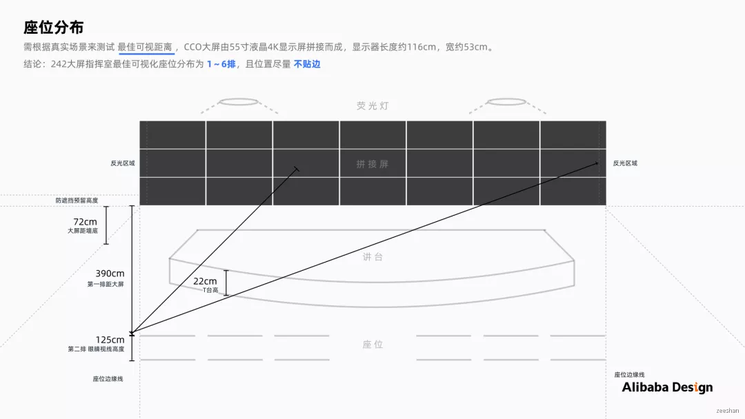

### 设计流程

设计大屏往往是服务于业务诉求，通过设计的手段来帮助用户达成目标。Alibaba Design为你总结了大屏设计济的9个关键点。

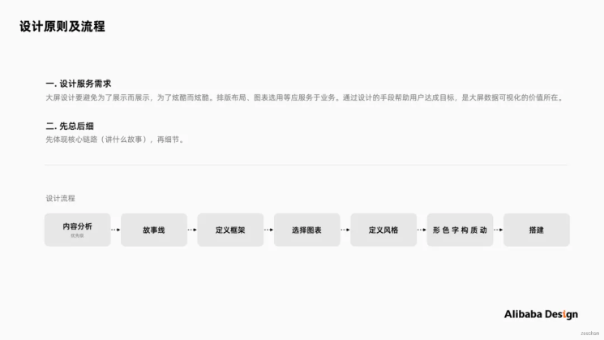

### 内容分析

可视化工作量庞大时，建议从项目优先级进行，从最重要、最不重要、不确定性排序。

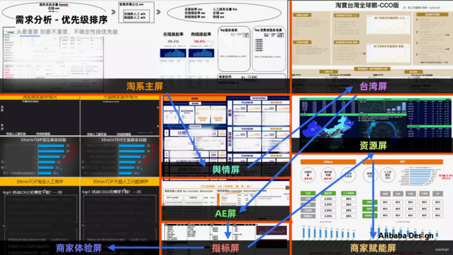

### 故事线

大屏展示的内容动线是用户第一感知，给用户讲述一个怎样的故事，需结合业务诉求来划分。通用结构为先总后。即先体现核心链路（讲什么故事）,再描述细节。

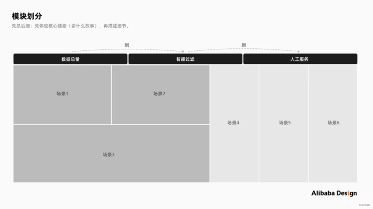

### 布局框架

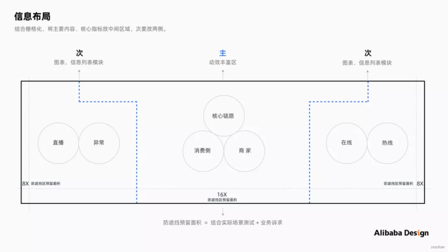

### 选择图表

图表是整个大屏视觉高光呈现点，可以帮助用户更快更直观的表达数据信息。通常包括基础图表和混合图表。基础图表包括：比较类、占比类、区间类、关联类、趋势类、时间类、地图类等。混合图表是指多个基础图表相互关联形态。以下总结了2种图表分别使用流程：

A.基础图表

- 确定内容：明确要用图表传达的核心信息。例：体现2020、2019基于时间趋势的求助量对比。
- 判断关系：判断数据之间比较类型。例：折线图。
- 选择类型：选择对应含义的图表。例：折线图。

B.混合图表

- 确定诉求：体现信息在多个图表里交互联动关系。例：体现多个问题在2020、2021的客诉量走势对比及相对应的用户声音。
- 选择类型：选择对应含义的图表。
- 制定方案：结合业务诉求、同技术制定交互方案。

### 定义风格

定义视觉风格-情绪板（Mood Board)指一系列图像、文字、样品的拼贴，是常用的表达设计定义和方向的设法论。方法是通过调研原生关键词-脑爆衍生关键词-搜索图片样式-提取情绪板-分析视觉风格。

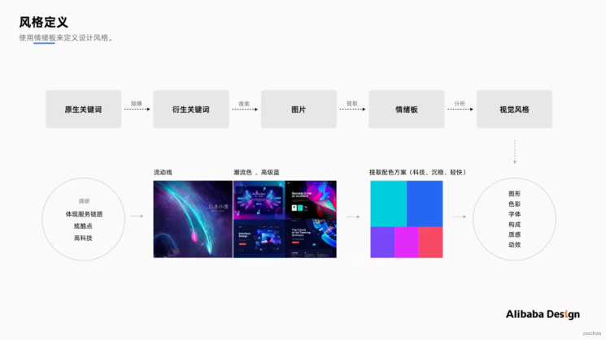

### 动效

对用户而言，大屏动效能便于用户理解，减少认知成本；增强代入感，提升用户体验。动效应优先满足核心内容、故事线。常见的大屏动效-展示类，用于突出产品核心功能和特点。界面信息按照一定的规律呈现，引导用视觉流向。

例如：突显从“量的发起”到“智能承载”到“人工接起”的数据流向。

注：3D动效在大屏使用越来越常见，但过于3D炫酷震撼也会失去可视化大屏的初衷-数据信息的传递。因此建用3D同学要围绕信息的传递，突出信息重点来使用。

### 颜色

美国学者诺阿，伊林斯基在《数据可视化之美》中，总结可视化审美的标准有四大要素-新颖、充实、高效和美观。可视化大屏如何通过颜色，既要美观又要突出重点。总结有以下几点：

- 配色易辨识与区分：采用色调、明度差异较大的颜色进行搭配组合。

- 冷暖色、互补色对比：在数据图表里，多采用冷暖色、互补色能产生强烈对比，突出重点信息。

  案例：

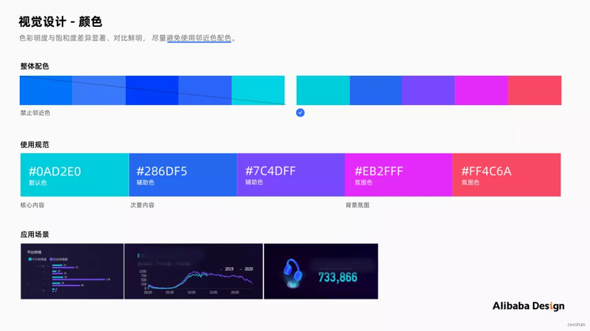

### 字体

一般大屏设计与开发优先选择系统默认字体，数字推荐DIN,特殊字体虽然也可通过字体包形式嵌入开发程序中，考虑到实现成本尽量不使用。
字号大小需要根据真实场地来选择，方法是：用户最佳可视距离-现场字号测试-用户调研-输出规范。四个步骤来验证。

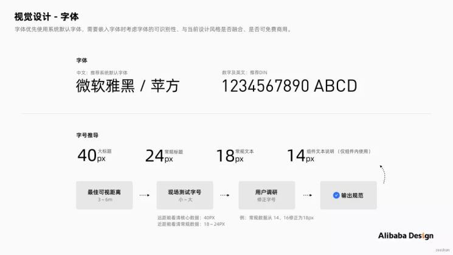

### 搭建

目前市面第三方开发工具有：Datav、Vshow、腾讯云图、百度智能云等。选择Datav(阿里云出品的拖拽式可视化工具）搭建，所见即所得，并规范大屏编辑权限：设计与开发，便于技术同学调试。

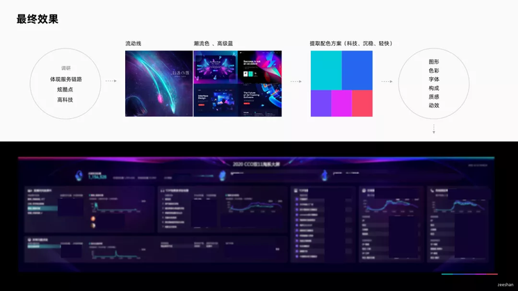

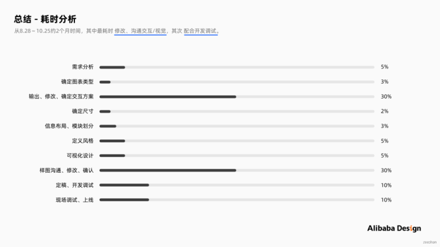

## 验收注意事项

可视化设计是一个任重道远的事情，大屏更是一个长期跟进的过程。很多细节在验收环节中才能发现到。以下从件效果和外在环境两个方面来分享。

### 硬件效果

#### 显示

不同设备的显示效果存在偏差，需要结合实际场景微调线上效果。建议对饱和度进行微调。

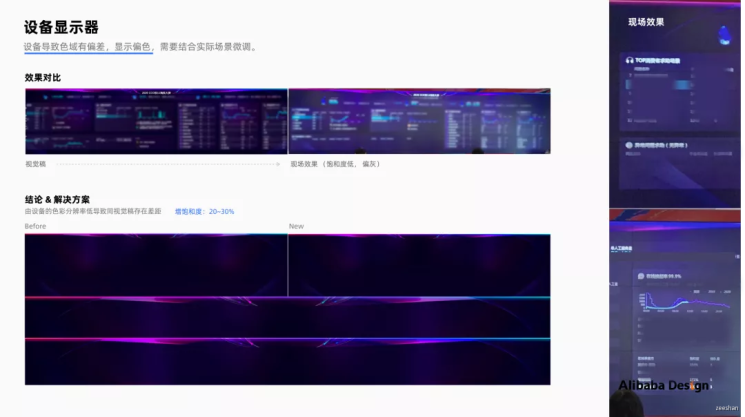

#### 渐变色差

渐变对于线上视觉呈现很不友好，在模块底色使用渐变的案例中，暗色渐变区域基本无法看清，且模块区分不明显。在此建议增描边或纯色。

#### 屏缝

上面提到拼接屏最大的设计问题是屏缝问题（0.3cm)。在布局前建议使用辅助线来辅助布局，规避信息在屏缝里。

#### 字体

如果遇到大屏字体丢失，通常原因是投屏电脑没有安装完整字体包。建议做好大屏视觉后，将所用到字体包导入到投屏电脑，并在电脑浏览器中设置默认字体。

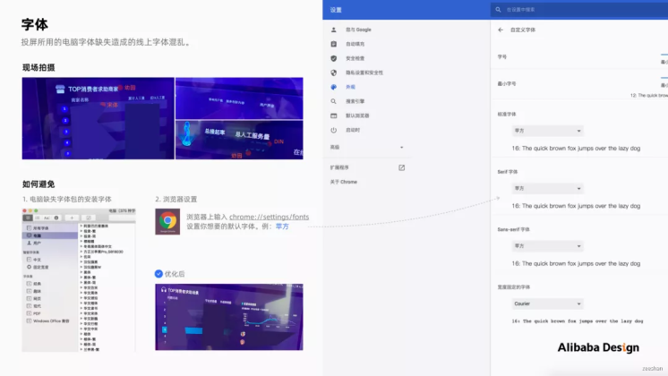

#### 字符数

在交付设计方案时，建议对大屏显示的数据字符极值标注，便于开发同学设定字符数及后续走查。

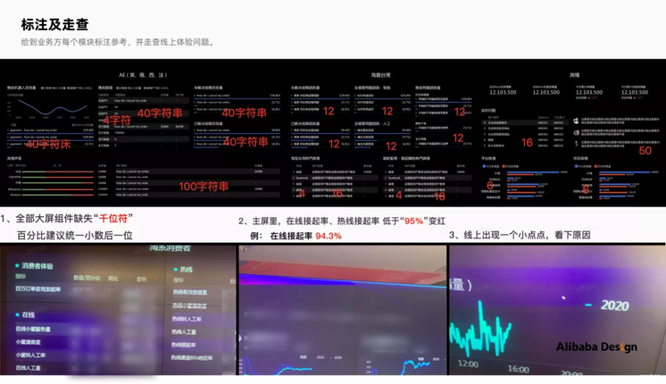

#### 分辨率

不能以大屏分辨率定义设计稿尺寸。举例实战案例中，拼接屏分辨率为13440(1920*7)*3240(1080*3),当设计稿选择13440px时，图片基本无法加载。

实战建议：

- 当大屏为单电脑分辨率时，设计稿可保持一致。例：1920*1080、1920*1200。
- 当大屏为超大分辨率时，使用等比例缩小分辨率。但需要现场测试大屏展示为正常。例：13440 * 3240,作图尺寸为4480*1080。

#### APNG

大屏常用的动效格式通常gif、apng。在此推荐使用apng。原因是gif格式有个致命弱点，对透明通道的支持非常有限，输出结果会很差，会有锯齿或白边情况。而apng格式在目前主流的所有浏览器上都可以完美支持，且完美支持透明通道。

制作流程：

- 使用AE等软件制作动画，输出png序列帧。
- 导入“png序列帧”到iSparta(apng图片转换器）中，设置路径并输出。
  (注：序列帧的名称应是统一连贯性，且帧数不宜过多以免apng生成失败）

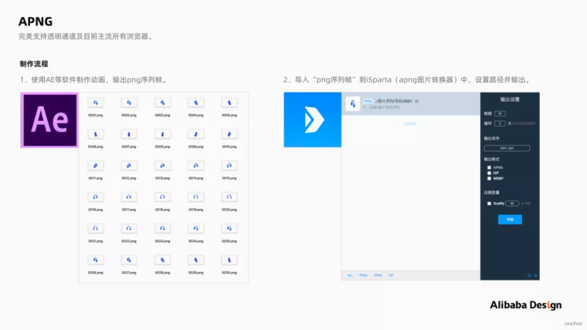

### 外在环境

#### 灯光

目前市场，灯泡光线最常见的有白、暖黄，大屏投放的场地，需考虑灯光的属性，不同色温会对大屏的投放造成视觉偏差。建议微调明度来改善。

#### 装饰

场地通常会有一些装饰物、氛围背景。需要考虑到大屏不受周边氛围、装饰物影响。例：现场考察背景氛围复杂干扰大屏信息；吊牌太高遮挡大屏视线。

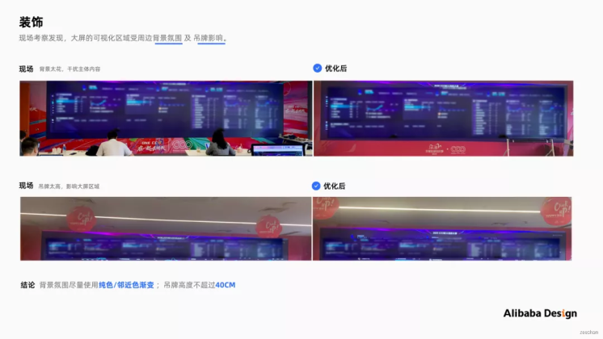

## 标准化

工作中遇到了大量的可视化诉求，通过将可视化衡量标准化，可以更好的验证做的好与坏。流程规范和组件化，可以更好的为项目提效。

### 规范流程化

通用的设计大屏的流程，建议可将方法文档沉淀（例：语雀）,或同产品、PM同步设计流程。

### 样式组件化

在不同业务有相同诉求时，可将通用样式组件化。设计可提炼的有：字符数、轮播秒数、Tab样式、氛围图、动效等，最终横向复用多个业务。
赋能案例：

### 衡量标准化

参考Antv大量项目实战经验，总结的四条可视化核心设计原则：准确、清晰、有效、美，来拆解可视化衡量指标，总结了以下描述：

- 准确：这个产品很准确表达数据的特征信息，提供的数据准确对我有用。11515
- 清晰：这个产品能一目了然的表达故事，能一目了然的了解每块内容表达的含义。
- 有效：这个产品传递对我有用的信息并满足我的业务诉求。
- 美：这个产品设计风格美观。

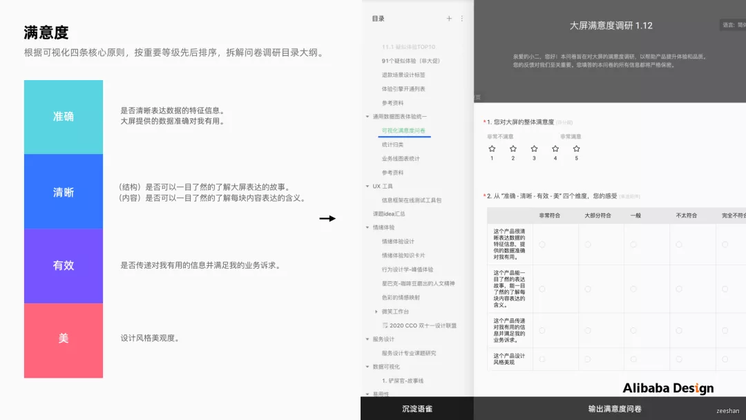