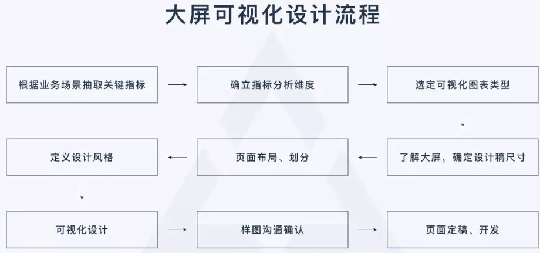
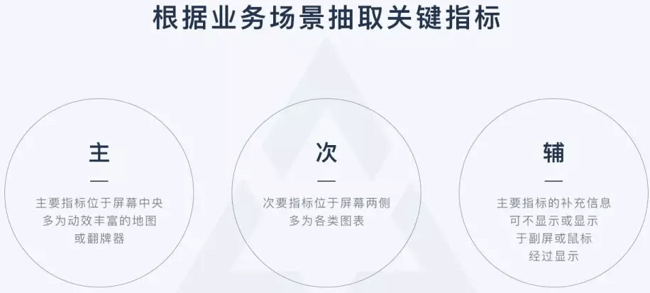
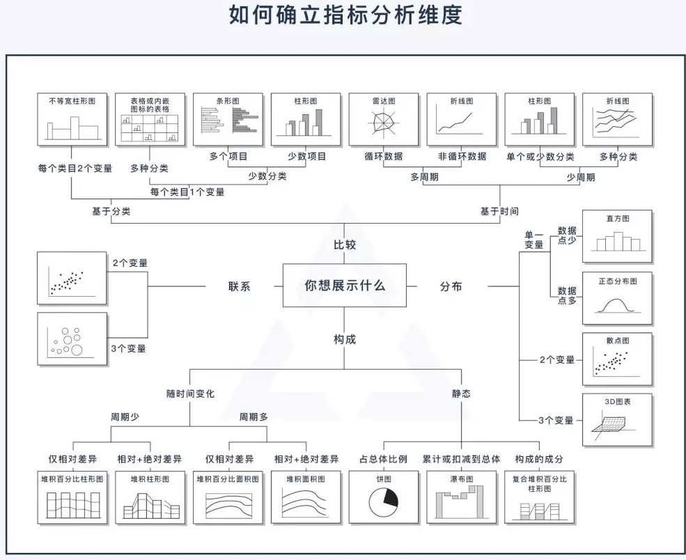
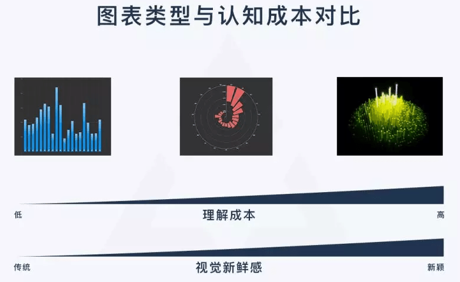
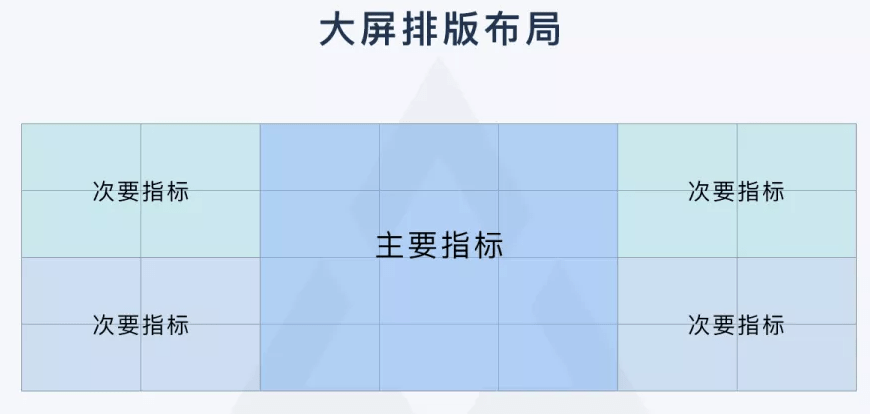
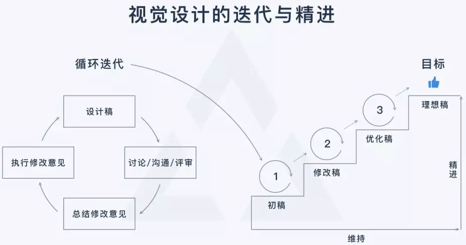
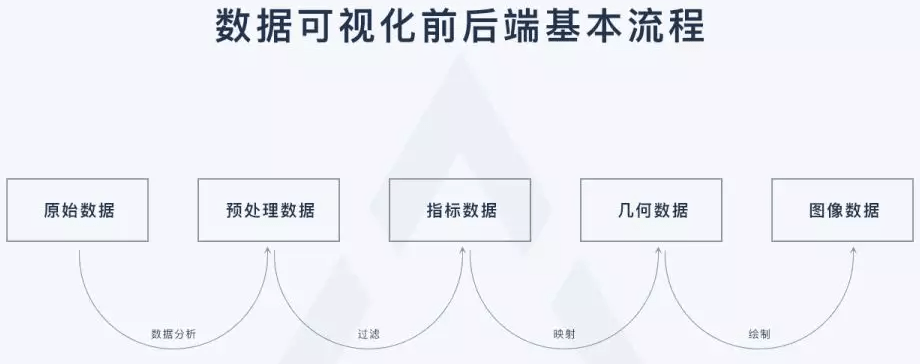

# 大屏设计流程

规范的流程是好结果的保证。找到一个可参考的流程，然后步步为营，就能避免很多不必要的返工，保证设计质量和项目进度。

## 1、根据业务场景抽取关键指标

关键指标是一些概括性词语，是对一组或者一系列数据的统称。一般情况下，一个指标在大屏上独占一块区域，所以通过关键指标定义，我们就知道大屏上大概会显示哪些内容以及大屏会被分为几块。以共享单车电子围栏监控系统为例，这里的关键指标有：企业停车时长、企业违停量、热点违停区域、车辆入栏率等。

确定关键指标后，根据业务需求拟定各个指标展示的优先级（主、次、辅）。

## 2、确立指标分析维度

“横看成岭侧成峰”。同一个指标的数据，从不同维度分析就有不同结果。很多小伙伴做完可视化设计，发现可视化图形并没有准确表达自己的意图，也没能向观者传达出应有的信息，可视化图形让人困惑或看不懂。出现这种情况很大程度就是因为分析的维度没有找准或定义的比较混乱。

上图向大家展示了数据分析常用的4个维度，我们在选定指标后，就需要跟项目组其他小伙伴讨论：我们的各个指标主要想给大家展示什么，更进一步的讲，是我们想通过可视化表达什么样的规律和信息。而上图，可以引导我们从“联系、分布、比较、构成”四个维度更有逻辑的思考这个问题。

**联系**：数据之间的相关性

**分布**：指标里的数据主要集中在什么范围、表现出怎样的规律

**比较**：数据之间存在何种差异、差异主要体现在哪些方面

**构成**：指标里的数据都由哪几部分组成、每部分占比如何

## 3、选定可视化图表类型

当确定好分析维度后，事实上我们所能选用的图表类型也就基本确定了。接下来我们只需要从少数几个图表里筛选出最能体现我们设计意图的那个就好了。

选定图表注意事项：易理解、可实现；

### 易理解

可视化设计要考虑大屏最终用户，可视化结果应该是一看就懂，不需要思考和过度理解，因而选定图表时要理性，避免为了视觉上的效果而选择一些对用户不太友好的图形。

### 可实现

1、我们需要了解现有数据的信息、规模、特征、联系等，然后评估数据是否能够支撑相应的可视化表现

2、我们设计的图形图表，要开发能够实现。实际工作中，一些可视化效果开发用代码写很容易实现，效果也不错，但这些效果设计师用Ps/Ai/Ae这些工具模拟时会发现比较困难；同样的，某些效果设计师用设计工具可以轻易实现，但开发要用代码落地却非常困难，所以大屏设计中跟开发常沟通非常重要，我们需要明确哪些地方设计师可以尽情发挥，哪些地方需要谨慎设计！一个项目总有周期与预算限制，不会无限期的修改迭代，所以设计师在这里需要抓住重点，有取舍，不钻牛角尖、死磕不放。

## 4、了解物理大屏，确定设计稿尺寸

**多数情况下设计稿分辨率即被投大屏的信号源电脑屏幕的分辨率。**有多个信号源时，就会有多个设计稿，此时每个设计稿的尺寸即对应信号源电脑屏幕的分辨率

一般情况下设计稿的分辨率就是电脑的分辨率，**当有多个信号源时，有时会通过显卡自定义电脑屏幕分辨率，从而使电脑显示分辨率不等于其物理分辨率，此时，对应设计稿的分辨率也就变成了设置后的分辨率；**此外，当被投电脑分辨率长宽比与大屏物理长宽比不一致时（单信号源），也会对被投电脑屏幕分辨率做自定义调整，这种情况设计稿分辨率也会发生变化。所以设计开始前**了解物理大屏长宽比很重要。**

## 5、页面布局、划分

尺寸确立后，接下来要对设计稿进行布局和页面的划分。这里的划分，主要根据我们之前定好的业务指标进行，核心业务指标安排在中间位置、占较大面积；其余的指标按优先级依次在核心指标周围展开。一般把有关联的指标让其相邻或靠近，把图表类型相近的指标放一起，这样能减少观者认知上的负担并提高信息传递的效率。

## 6、定义设计风格

很多小伙伴也许没接触过大屏设计工作，但大多数人都应该有APP或者Web风格定义的经验。我们在定义一款APP或者Web页面设计风格时常用的方法是什么呢？**情绪版！**

大屏虽酷炫，但实际上也是运行在浏览器里的Web页面，所以大屏设计风格定义方法也同样可以是用情绪版来做，这种方法也是目前比较科学高效的风格定义手段

上图提供了情绪版应用的脑图，具体操作细节不做介绍，不太了解的小伙伴可以自己找找资料哈。

情绪版的一套流程下来，我们定义的风格基本是科学准确的，可以指导我们执行设计。如果是给甲方爸爸做大屏，这个流程也可以让我们提出的方案更有说服力

## 7、可视化设计

根据定义好的设计风格与选定的图表类型进行合理的可视化设计。目前来讲大屏可视化主要有指标类信息点和地理类信息点两大可视化数据。指标类信息点可视化效果相对简单易实现，而地理类信息点一般可视化效果酷炫，但是开发相对困难，需要设计师跟开发多沟通的。地理类信息一般具有很强的空间感、丰富的粒子、流光等动效、高精度的模型和材质以及可交互实时演算等特点，所以对于被投电脑、大屏拼接器等硬件设备的性能会有要求，硬件配置不够的情况下可能出现卡顿甚至崩溃的情况，所以这点也是需要提前沟通评估的。

## 8、样图沟通确认

这里的沟通分三个层面：设计师对内沟通、设计师对外沟通、设计师与大屏的“沟通”。

样图沟通环节，最初的样图不需要十分精致，我们可以把它理解为一个“低保真”原型，然后通过不断沟通修改，让它逐步完善精致起来，也就是小步快跑，避免那种一下子走到终点，然后又大修大改的情况。

因为我们在前几步已经分别确定了页面布局、图表类型、页面风格特点，所以这一步我们需要用尽可能简单的方法 ，把之前几步的成果在页面上快速体现出来，然后根据样图效果尝试确定五方面内容：

**1、之前确立的布局在放入设计内容后是否依然合适**

**2、确立的图表类型带入数据后是否仍然客观准确**

**3、根据关键元素、色彩、结构、质感打造出的页面风格是否基本传达出了预期的氛围和感受**

**4、已有的样式、数据内容、动效等在开发实现方面是否存在问题**

**5、大屏是否存在色差、文字内容是否清晰可见、页面是否存在变形拉伸等现象**

**跟大屏“沟通”是比较重要也是个特殊的环节**，这也是我觉得大屏设计跟其它设计不一样的地方，大屏有它自己独特的分辨率、屏幕组成、色彩显示以及运行、展示环境，这里的很多问题只有设计稿投到大屏上才能够被发现，所以这一步在样图沟通确认环节非常重要，有时候需要开发出demo，反复测试多次。

## 9、页面定稿、开发

事实上页面开发阶段并不是到了这一步才进行，这里说的页面开发仅指前端样式的实现，实际上后台数据准备工作在定义好分析指标后就已经开始进行了，而我们当前的工作是把数据接入到前端，然后用设计的样式呈现出来。

**切图与标注**

由于大屏实际就是一个web页面，所以开发阶段的切图与标注是少不了的。

**切图：哪些元素需要切图，怎么切？**

一般开发用代码写不出的样式或动效，都需要设计师切图作支持：比如数据容器的边框、小的动效、页面整体大背景、部分图标等。切图按正常网页设计标准切就可以了。

**标注**

Web页面用什么插件做标注这个大家都很熟悉，我就不多说了。需要注意的是，如果大屏页面需要在不同比例的终端展示，那么此时的标注与开发可以使用**rem**作为基本单位来实现，这样实现的大屏页面在后期会有更好的扩展性与适应性。

## 10、整体细节调优与测试

这部分是指页面开发完成后，将真实页面投放到大屏进行的测试与优化。这里主要有两部分工作。

**视觉方面的测试**（有点像APP的UI走查）：关键视觉元素、字体字号、页面动效、图形图表等是否按预期显示、有无变形、错位等情况。

**性能与数据方面的测试**：图形图表动画是否流畅、数据加载、刷新有无异常；页面长时间展示是否存在奔溃、卡死等情况；后台控制系统能否正常切换前端页面显示。

