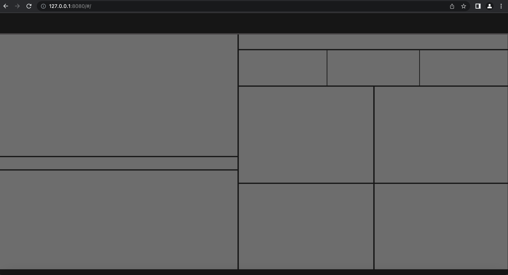

# 快速入门

## 创建项目

::: tip 提示
参见"环境部署"
:::

## 初始化项目

我们在 /src 目录下修改 app.vue：
```html
<template>
  <div id="app">
    <router-view/>
  </div>
</template>

<style lang="scss">
  html,body,#app{
    width: 100%;
    height: 100%;
    padding: 0;
    margin: 0;
  }
</style>
```

我们在 /src/views 目录下修改 HomeView.vue：
```html
<template>
  <div class="home">

  </div>
</template>

<script>

export default {
  name: 'HomeView'
}
</script>
```
我们在 /src/router 目录下修改 index.js：
```js
import { createRouter, createWebHashHistory } from 'vue-router'
import HomeView from '../views/HomeView.vue'

const routes = [
  {
    path: '/',
    name: 'home',
    component: HomeView
  }
]

const router = createRouter({
  history: createWebHashHistory(),
  routes
})

export default router
```
::: tip 提示
删除多余文件：/src/view/About.vue
           /src/components下HomeView目录
:::

## 按照设计图搭DIV框架

::: tip 提示
需要美工或设计人员提供设计图和相关素材（屏幕尺寸、布局、长度、宽度、padding、margin、字体、字号、颜色、svg图标等）
建议屏幕按照 3840*2160 设计
:::


开发人员搭建div框架



## 添加组件
::: tip 提示
在每个div中添加组件
:::

## 界面优化
::: tip 提示
按照设计图，优化界面
:::

## 接入数据
::: tip 提示
按照组件数据格式，接入业务数据
:::

## 大屏适配
::: tip 提示
接入大屏，环境适配
:::

## 项目发布


* [echarts](https://echarts.apache.org/zh/) 
* [山海鲸可视化](https://www.shanhaibi.com/)
* [四方伟业](http://www.sefonsoft.com/) 
* [地图数据](http://datav.aliyun.com/portal/school/atlas/area_selector)
* [百度坐标识别](https://api.map.baidu.com/lbsapi/getpoint/index.html) 
* [ECharts 中的样式简介](https://echarts.apache.org/handbook/zh/concepts/style/#echarts-%E4%B8%AD%E7%9A%84%E6%A0%B7%E5%BC%8F%E7%AE%80%E4%BB%8B)
* [主题编辑器](https://echarts.apache.org/zh/theme-builder.html)

* openlayers
https://www.jianshu.com/p/4af2a52a0fc6
https://www.cnblogs.com/nscqbc/p/3466919.html 
https://chenjiamian.github.io/OpenLayers-3.x-Cookbook-Doc/# 
https://blog.csdn.net/u011435933/article/details/80439510 

* [Gallery](https://www.isqqw.com/homepage#/homepage)
* [曲面](https://blog.csdn.net/qq_20042935/article/details/89876921)
* [在线工具](https://tool.lu/)


折线图在数据量远大于像素点时候的降采样策略,https://echarts.apache.org/zh/option.html#series-line.sampling
https://github.com/ecomfe/awesome-echarts


vue 2
vue create xxx
vue add element

说明|属性|参数
:---:|---|---
flex布局|display|flex 
flex方向|flex-direction|row/column
主抽的位置|align-items|flex-start/flex-end/center
主抽上的对齐方式|justify-content|flex-start/flex-end/center/space-between/space-around/space-evenly
子元素flex属性(获得剩余的面积)|flex| 1
子元素flex属性(定义水平排列div宽度)|flex|0 0 widthpx

### 开启flex
```html
* display: flex 默认水平（主轴）方向排列，块
* display: inline-flex  行内块
```

### 设置子元素的整体排列方向 flex-direction
```css
flex-direction: row 默认，水平方向，向右
                row-reverse 水平方向反转，向左
                column  垂直方向，向下
                column-reverse 垂直方向，向上
```
                
### 设置子元素是否换行 flex-wrap
```css
flex-wrap: nowrap 默认，不换行
           wrap  换行
           wrap-reverse 向上换行
```
           
### 同时设置flex布局的方向和是否换行 flex-flow
```css
flex-flow: row 水平方向，向右
           row-reverse 水平方向反转，向左
           column  垂直方向，向下
           column-reverse 垂直方向，向上
           nowrap 不换行
           wrap  换行
           wrap-reverse 向上换行
```
           
### 设置flex布局(主轴方向上)的对齐和分布方式 justify-content
```css
justify-content: flex-start 默认，主轴的起始端
                 center 主轴的中心位置
                 flex-end 主轴的末端
                 space-between 两端对齐，空隙大小一样
                 space-around 环绕对齐，两边空隙的大小是其他空隙的一半
                 space-evenly 平均分布，空隙大小一样
```
                 
### 设置 flex 布局交叉轴上子元素的对齐方式 align-items
```css
align-items: stretch 默认，拉伸，当子元素设置高度时，会失效
             flex-start 顶部对齐
             flex-end   底部对齐
             center     中部对齐
             baseline   基线对齐，文字位置为基线
```

### 设置 flex 布局交叉轴多行子元素的分布 align-content(item大于等于2行生效)
```css
align-content: stretch 默认， 拉伸
               flex-start    顶部对齐
               flex-end      底部对齐
               center        中部对齐
               space-between 两端对齐，空隙大小一样
               space-around  环绕对齐，两边空隙的大小是其他空隙的一半
               space-evenly  平均分布，空隙大小一样
```

### 设置 flex 子元素的排列顺序  order
```css
order: 0 默认，数字越小子元素排列在前面
```

### 设置 flex 布局子元素的宽度扩展 flex-grow
```css
flex-grow: 0 默认，
           1 分配所有剩余空间，如果只设置一个1，就分配剩余空间
             设置的和>1,就会把所有剩余空间/flex-grow的和，按次比例分配
             设置的和<=1,就按照剩余空间等比例分配
```
             
### 设置 flex 布局子元素是否可以不收缩 flex-shrink
```css
flex-shrink: 1 默认，
             0 不压缩
```
             
### 设置 flex 布局的基础尺寸 flex-basis
```css
flex-basis: auto 默认
            xxpx;
```
            
### 设置 flex 布局子元素宽度的扩展、收缩、基础尺寸 flex
```css
flex: flex-grow flex-shrink flex-basis
      0 1 auto 默认
      none ==> 0 1 auto
      auto ==> 1 1 auto
      无单位就是flex-grow,有单位就是flex-basis
      1 平均分
      120px ==> 1 1 120px
      1 1 ==> flex-grow flex-shrink
      1 120px ==> flex-grow flex-basis
```
      
### 设置 flex 布局单个子元素在交叉轴上的对齐方式 align-self
```css
align-self: auto 默认，继承 align-items
            flex-start 顶端
            center     中间端
            flex-end   地端
            baseline   基线对齐
            stretch    拉伸 
```    
      


             


                 


                

                


